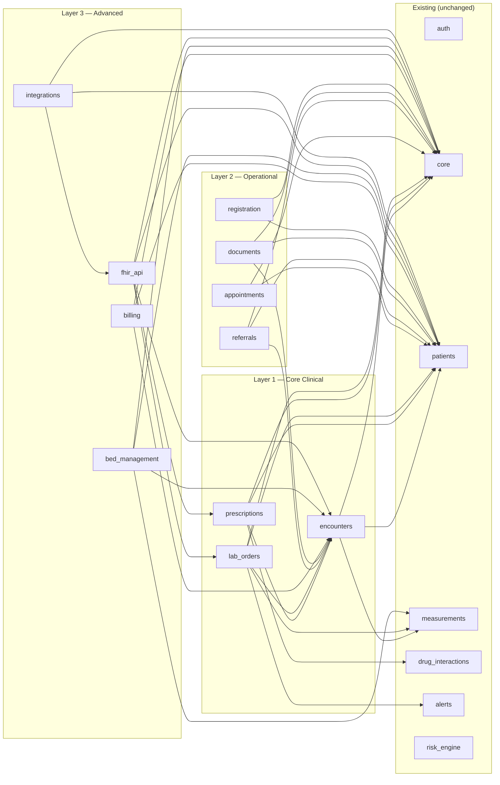
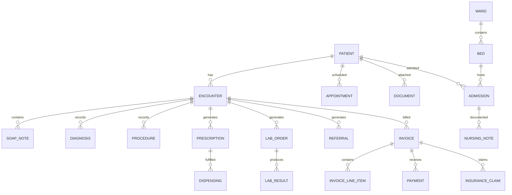

# Design Document: EMR Hospital System

## Overview

The EMR Hospital System extends PrescpHealth from an AI-powered clinical decision support platform into a full Electronic Medical Record (EMR/EHR) system. It adds clinical workflow modules (encounters, prescriptions, lab orders), operational modules (appointments, referrals, documents, registration), and advanced modules (billing, inpatient/bed management, FHIR R4 API, external integrations) — all built on the existing FastAPI + SQLAlchemy async + PostgreSQL RLS architecture.

### Key Design Decisions

1. **Same module pattern as existing code** — Each EMR domain is a self-contained package under `backend/app/modules/` following the established router/service/models/schemas split with ~150 line max per file.

2. **FHIR-first data modeling** — Internal relational models are designed to map cleanly to FHIR R4 resources. A `fhir_json` JSONB column on core clinical tables stores the FHIR representation alongside relational data, enabling API exposure without runtime transformation.

3. **Event-driven integration with existing pipeline** — Lab results and inpatient vitals publish `MeasurementSaved` events to trigger risk computation. Prescriptions invoke the existing Drug Interaction engine. Encounters update patient chronic conditions.

4. **Layered deployment** — Layer 1 (encounters, prescriptions, labs) ships first, Layer 2 (appointments, referrals, documents, registration) second, Layer 3 (billing, beds, FHIR API, integrations) third. Each layer is independently deployable.

5. **Code catalog validation** — ICD-10, ATC, and LOINC codes are validated against local lookup tables seeded from official sources, not external API calls, ensuring offline capability and sub-5ms validation.

---

## Architecture

### High-Level System Architecture (EMR Extension)

```mermaid
graph TB
    subgraph "Client Tier"
        FE[React/TypeScript SPA]
        PP[Patient Portal - Mobile-First]
    end

    subgraph "API Tier — Existing Modules"
        GW[API Gateway / Auth Middleware]
        AM[Auth Module]
        PM[Patient Module]
        MM[Measurement Module]
        RE[Risk Engine API]
        DIE[Drug Interaction API]
        ALT[Alert API]
    end

    subgraph "API Tier — EMR Modules (New)"
        EM[Encounter Module]
        RX[Prescription Module]
        LAB[Lab Order Module]
        APT[Appointment Module]
        REF[Referral Module]
        DOC[Document Module]
        REG[Registration Module]
        BILL[Billing Module]
        BED[Bed Management Module]
        FHIR[FHIR API Module]
        INT[Integration Module]
    end

    subgraph "Background Workers (Celery)"
        NW[Notification Worker]
        SYNC[Integration Sync Worker]
        FHIR_W[FHIR Subscription Worker]
    end

    subgraph "Data Tier"
        PG[(PostgreSQL + RLS)]
        RD[(Redis - Cache/Queue)]
        S3[(Object Storage - Documents)]
    end

    FE --> GW
    PP --> GW
    GW --> AM & PM & MM & RE & DIE & ALT
    GW --> EM & RX & LAB & APT & REF & DOC & REG & BILL & BED & FHIR & INT
    RX -->|"check_ddi/check_dhi"| DIE
    LAB -->|"MeasurementSaved event"| MM
    BED -->|"MeasurementSaved event"| MM
    EM -->|"update chronic_conditions"| PM
    INT --> SYNC
    FHIR --> FHIR_W
    APT --> NW
    DOC --> S3
    EM & RX & LAB & APT & REF & DOC & REG & BILL & BED --> PG
```



### Module Dependency Map



### Integration Points with Existing Modules

| EMR Module | Existing Module | Integration Type | Description |
|-----------|----------------|-----------------|-------------|
| Encounters | patients | Direct import | Updates `chronic_conditions` JSONB on diagnosis |
| Prescriptions | drug_interactions | Service call | Invokes `check_ddi()` and `check_dhi()` before confirming |
| Lab Orders | measurements | Event publish | Creates Measurement record, publishes `MeasurementSaved` |
| Lab Orders | alerts | Event publish | Triggers alert on abnormal results |
| Bed Management | measurements | Event publish | Vitals charting creates Measurements, publishes events |
| All EMR modules | auth/rbac | Dependency | Uses `require_role()` for endpoint protection |
| All EMR modules | audit | Service call | Logs all CUD operations via AuditService |
| All EMR modules | core/events | Event publish | Publishes domain events for cross-module reactions |

---

## Components and Interfaces

### New Module Structure

```
backend/app/modules/
├── encounters/
│   ├── models.py              # Encounter, SOAPNote, Diagnosis, Procedure models
│   ├── schemas.py             # Pydantic request/response schemas
│   ├── router.py              # POST /encounters, GET list
│   ├── router_detail.py       # GET/PUT /encounters/{id}, discharge
│   ├── service.py             # EncounterService orchestration
│   ├── service_soap.py        # SOAP note CRUD
│   ├── service_diagnosis.py   # Diagnosis recording + chronic condition sync
│   ├── fhir_mapper.py         # Encounter → FHIR R4 Encounter mapping
│   └── enums.py               # EncounterStatus, EncounterClass enums
├── prescriptions/
│   ├── models.py              # Prescription, Dispensing models
│   ├── schemas.py
│   ├── router.py              # CRUD + refill endpoints
│   ├── service.py             # PrescriptionService with DDI integration
│   ├── service_refill.py      # Refill logic
│   ├── fhir_mapper.py         # Prescription → FHIR MedicationRequest
│   └── enums.py               # PrescriptionStatus enum
├── lab_orders/
│   ├── models.py              # LabOrder, LabResult models
│   ├── schemas.py
│   ├── router.py              # Order + result endpoints
│   ├── service.py             # LabOrderService with measurement integration
│   ├── service_results.py     # Result recording + alert generation
│   ├── fhir_mapper.py         # LabOrder → FHIR ServiceRequest/DiagnosticReport
│   └── enums.py               # LabOrderStatus, Priority enums
├── appointments/
│   ├── models.py              # Appointment, Waitlist models
│   ├── schemas.py
│   ├── router.py              # Scheduling CRUD
│   ├── service.py             # AppointmentService with conflict detection
│   ├── service_waitlist.py    # Waitlist management
│   ├── service_recurrence.py  # Recurring appointment generation
│   └── enums.py               # AppointmentStatus, AppointmentType enums
├── referrals/
│   ├── models.py              # Referral model
│   ├── schemas.py
│   ├── router.py              # Referral CRUD + completion
│   ├── service.py             # ReferralService
│   └── enums.py               # ReferralStatus, Urgency enums
├── documents/
│   ├── models.py              # Document model
│   ├── schemas.py
│   ├── router.py              # Upload, list, download endpoints
│   ├── service.py             # DocumentService with S3 integration
│   ├── storage.py             # S3/object storage abstraction
│   └── enums.py               # DocumentType enum
├── registration/
│   ├── models.py              # Consent, IdentityVerification models
│   ├── schemas.py
│   ├── router.py              # Intake workflow endpoints
│   ├── service.py             # RegistrationService
│   └── service_consent.py     # Consent capture logic
├── billing/
│   ├── models.py              # Invoice, InvoiceLineItem, Payment, InsuranceClaim
│   ├── schemas.py
│   ├── router.py              # Invoice + payment + claims endpoints
│   ├── service.py             # BillingService
│   ├── service_claims.py      # Insurance claim processing
│   └── enums.py               # InvoiceStatus, ClaimStatus, PaymentMethod enums
├── bed_management/
│   ├── models.py              # Ward, Bed, Admission, NursingNote models
│   ├── schemas.py
│   ├── router.py              # Admission, discharge, bed status endpoints
│   ├── service.py             # BedManagementService
│   ├── service_nursing.py     # Nursing notes + vitals charting
│   └── enums.py               # BedStatus, DischargeType enums
├── fhir_api/
│   ├── router.py              # FHIR RESTful endpoints per resource type
│   ├── router_bulk.py         # Bulk data export endpoint
│   ├── service.py             # FHIRService — parse/print/validate
│   ├── validator.py           # FHIR R4 schema validation
│   ├── search.py              # FHIR search parameter parsing
│   ├── subscriptions.py       # Webhook subscription management
│   └── auth_oauth.py          # OAuth 2.0 client credentials for external systems
└── integrations/
    ├── models.py              # SyncLog, ConnectorConfig models
    ├── schemas.py
    ├── router.py              # Connector management endpoints
    ├── service.py             # IntegrationService orchestration
    ├── connectors/
    │   ├── openmrs.py         # OpenMRS connector
    │   ├── dhis2.py           # DHIS2 connector
    │   └── generic_fhir.py    # Generic FHIR R4 connector
    ├── sync_engine.py         # Conflict resolution + retry logic
    └── tasks.py               # Celery tasks for async sync
```

### API Endpoints

#### Encounters (Layer 1)

| Method | Endpoint | Description | Roles |
|--------|----------|-------------|-------|
| POST | `/api/v1/encounters` | Create encounter (check-in) | Doctor, Nurse |
| GET | `/api/v1/encounters` | List encounters (filterable) | Doctor, Nurse |
| GET | `/api/v1/encounters/{id}` | Get encounter detail | Doctor, Nurse |
| PUT | `/api/v1/encounters/{id}` | Update encounter | Doctor |
| POST | `/api/v1/encounters/{id}/soap-notes` | Add SOAP note | Doctor |
| POST | `/api/v1/encounters/{id}/diagnoses` | Record diagnosis (ICD-10) | Doctor |
| POST | `/api/v1/encounters/{id}/procedures` | Record procedure | Doctor |
| POST | `/api/v1/encounters/{id}/discharge` | Complete + discharge summary | Doctor |
| GET | `/api/v1/patients/{id}/encounters` | Patient encounter history | Doctor, Nurse |

#### Prescriptions (Layer 1)

| Method | Endpoint | Description | Roles |
|--------|----------|-------------|-------|
| POST | `/api/v1/prescriptions` | Write prescription (triggers DDI) | Doctor |
| GET | `/api/v1/prescriptions` | List prescriptions (filterable) | Doctor, Nurse |
| GET | `/api/v1/prescriptions/{id}` | Get prescription detail | Doctor, Nurse |
| PUT | `/api/v1/prescriptions/{id}/status` | Update status (discontinue, hold) | Doctor |
| POST | `/api/v1/prescriptions/{id}/refill` | Process refill request | Doctor |
| GET | `/api/v1/patients/{id}/prescriptions` | Patient prescription history | Doctor, Nurse |

#### Lab Orders (Layer 1)

| Method | Endpoint | Description | Roles |
|--------|----------|-------------|-------|
| POST | `/api/v1/lab-orders` | Create lab order (LOINC validated) | Doctor, Nurse |
| GET | `/api/v1/lab-orders` | List lab orders (filterable) | Doctor, Nurse |
| GET | `/api/v1/lab-orders/{id}` | Get lab order detail + results | Doctor, Nurse |
| PUT | `/api/v1/lab-orders/{id}/status` | Update status | Nurse |
| POST | `/api/v1/lab-orders/{id}/results` | Record lab result | Doctor, Nurse |
| GET | `/api/v1/patients/{id}/lab-orders` | Patient lab history | Doctor, Nurse |

#### Appointments (Layer 2)

| Method | Endpoint | Description | Roles |
|--------|----------|-------------|-------|
| POST | `/api/v1/appointments` | Book appointment | Nurse, Clinic_Admin |
| GET | `/api/v1/appointments` | List/calendar (filterable) | Nurse, Doctor, Clinic_Admin |
| GET | `/api/v1/appointments/{id}` | Get appointment detail | Nurse, Doctor |
| PUT | `/api/v1/appointments/{id}` | Reschedule appointment | Nurse, Clinic_Admin |
| DELETE | `/api/v1/appointments/{id}` | Cancel appointment | Nurse, Clinic_Admin |
| POST | `/api/v1/appointments/waitlist` | Add to waitlist | Nurse, Clinic_Admin |
| GET | `/api/v1/patients/{id}/appointments` | Patient appointments | All clinical |

#### Referrals (Layer 2)

| Method | Endpoint | Description | Roles |
|--------|----------|-------------|-------|
| POST | `/api/v1/referrals` | Create referral | Doctor |
| GET | `/api/v1/referrals` | List referrals (filterable) | Doctor, Nurse |
| GET | `/api/v1/referrals/{id}` | Get referral detail | Doctor, Nurse |
| PUT | `/api/v1/referrals/{id}/status` | Update referral status | Doctor |
| POST | `/api/v1/referrals/{id}/completion` | Record specialist findings | Doctor |

#### Documents (Layer 2)

| Method | Endpoint | Description | Roles |
|--------|----------|-------------|-------|
| POST | `/api/v1/documents` | Upload document | Doctor, Nurse, Clinic_Admin |
| GET | `/api/v1/documents` | List documents (filterable) | Doctor, Nurse |
| GET | `/api/v1/documents/{id}` | Get document metadata | Doctor, Nurse |
| GET | `/api/v1/documents/{id}/download` | Download file | Doctor, Nurse |
| GET | `/api/v1/patients/{id}/documents` | Patient documents | Doctor, Nurse |

#### Registration (Layer 2)

| Method | Endpoint | Description | Roles |
|--------|----------|-------------|-------|
| POST | `/api/v1/registration/intake` | Start intake workflow | Nurse, Clinic_Admin |
| PUT | `/api/v1/registration/{id}` | Update partial registration | Nurse, Clinic_Admin |
| POST | `/api/v1/registration/{id}/consent` | Capture consent | Nurse, Clinic_Admin |
| POST | `/api/v1/registration/{id}/identity` | Record ID verification | Nurse, Clinic_Admin |
| POST | `/api/v1/registration/{id}/complete` | Finalize → create Patient | Nurse, Clinic_Admin |

#### Billing (Layer 3)

| Method | Endpoint | Description | Roles |
|--------|----------|-------------|-------|
| POST | `/api/v1/invoices` | Generate invoice from encounter | Clinic_Admin |
| GET | `/api/v1/invoices` | List invoices (filterable) | Clinic_Admin |
| GET | `/api/v1/invoices/{id}` | Get invoice detail | Clinic_Admin |
| POST | `/api/v1/invoices/{id}/payments` | Record payment | Clinic_Admin |
| POST | `/api/v1/insurance-claims` | Submit insurance claim | Clinic_Admin |
| GET | `/api/v1/insurance-claims` | List claims (filterable) | Clinic_Admin |
| PUT | `/api/v1/insurance-claims/{id}/status` | Update claim status | Clinic_Admin |

#### Bed Management (Layer 3)

| Method | Endpoint | Description | Roles |
|--------|----------|-------------|-------|
| POST | `/api/v1/admissions` | Admit patient to bed | Doctor |
| GET | `/api/v1/beds` | Bed availability dashboard | Nurse, Doctor |
| GET | `/api/v1/admissions/{id}` | Get admission detail | Nurse, Doctor |
| POST | `/api/v1/admissions/{id}/nursing-notes` | Add nursing note | Nurse |
| POST | `/api/v1/admissions/{id}/vitals` | Chart vitals | Nurse |
| POST | `/api/v1/admissions/{id}/discharge` | Initiate discharge | Doctor |

#### FHIR API (Layer 3)

| Method | Endpoint | Description | Auth |
|--------|----------|-------------|------|
| GET | `/fhir/r4/{resourceType}` | Search FHIR resources | OAuth 2.0 |
| GET | `/fhir/r4/{resourceType}/{id}` | Read FHIR resource | OAuth 2.0 |
| POST | `/fhir/r4/{resourceType}` | Create FHIR resource | OAuth 2.0 |
| PUT | `/fhir/r4/{resourceType}/{id}` | Update FHIR resource | OAuth 2.0 |
| GET | `/fhir/r4/$export` | Bulk data export | OAuth 2.0 |
| POST | `/fhir/r4/Subscription` | Register webhook | OAuth 2.0 |

---

## Data Models

### FHIR Resource Mapping Strategy

Each core clinical table stores a `fhir_json` JSONB column containing the FHIR R4 representation. This is computed on write (not on read) so the FHIR API can serve resources directly from the column without transformation overhead.

| Internal Model | FHIR R4 Resource | Key Mapped Fields |
|---------------|-----------------|-------------------|
| Encounter | Encounter | status, class, type, subject, participant, period, reasonCode |
| Prescription | MedicationRequest | status, intent, medicationCodeableConcept, subject, dosageInstruction |
| LabOrder | ServiceRequest | status, intent, code, subject, requester, priority |
| LabResult | DiagnosticReport + Observation | status, code, subject, result, valueQuantity, referenceRange |
| Patient (existing) | Patient | identifier, name, telecom, gender, birthDate, address |
| Diagnosis | Condition | clinicalStatus, code, subject, encounter, recordedDate |

### Entity-Relationship Diagram (EMR Tables)



### Core Table Definitions

#### `encounters`

| Column | Type | Constraints | Description |
|--------|------|-------------|-------------|
| `id` | UUID | PK, DEFAULT uuid4 | Encounter identifier |
| `tenant_id` | UUID | FK → tenants.id, NOT NULL, INDEX | RLS isolation |
| `patient_id` | UUID | FK → patients.id, NOT NULL | Patient being seen |
| `clinician_id` | UUID | FK → users.id, NOT NULL | Assigned clinician |
| `status` | VARCHAR(20) | NOT NULL | planned, in_progress, completed, cancelled |
| `encounter_class` | VARCHAR(20) | NOT NULL | ambulatory, inpatient, emergency |
| `reason_for_visit` | TEXT | NOT NULL | Chief complaint / reason |
| `check_in_time` | TIMESTAMPTZ | NOT NULL | When patient arrived |
| `check_out_time` | TIMESTAMPTZ | NULLABLE | When encounter ended |
| `discharge_summary` | JSONB | NULLABLE | Generated on completion |
| `fhir_json` | JSONB | NULLABLE | FHIR R4 Encounter resource |
| `created_at` | TIMESTAMPTZ | NOT NULL, DEFAULT NOW() | Creation timestamp |
| `updated_at` | TIMESTAMPTZ | NOT NULL, DEFAULT NOW() | Last update |

**RLS Policy:** `tenant_id = current_setting('app.current_tenant')::uuid`
**Indexes:** `(tenant_id, patient_id, check_in_time DESC)`, `(tenant_id, clinician_id, status)`

#### `soap_notes`

| Column | Type | Constraints | Description |
|--------|------|-------------|-------------|
| `id` | UUID | PK | SOAP note identifier |
| `tenant_id` | UUID | FK → tenants.id, NOT NULL | RLS isolation |
| `encounter_id` | UUID | FK → encounters.id, NOT NULL | Parent encounter |
| `subjective` | TEXT | NULLABLE | Patient's reported symptoms |
| `objective` | TEXT | NULLABLE | Clinician observations |
| `assessment` | TEXT | NULLABLE | Clinical assessment |
| `plan` | TEXT | NULLABLE | Treatment plan |
| `recorded_by` | UUID | FK → users.id, NOT NULL | Authoring clinician |
| `created_at` | TIMESTAMPTZ | NOT NULL | Creation timestamp |
| `updated_at` | TIMESTAMPTZ | NOT NULL | Last update |

#### `diagnoses`

| Column | Type | Constraints | Description |
|--------|------|-------------|-------------|
| `id` | UUID | PK | Diagnosis identifier |
| `tenant_id` | UUID | FK → tenants.id, NOT NULL | RLS isolation |
| `encounter_id` | UUID | FK → encounters.id, NOT NULL | Parent encounter |
| `patient_id` | UUID | FK → patients.id, NOT NULL | Patient |
| `icd10_code` | VARCHAR(10) | NOT NULL | ICD-10 code (validated) |
| `display_name` | VARCHAR(500) | NOT NULL | Human-readable name |
| `is_chronic` | BOOLEAN | NOT NULL, DEFAULT FALSE | Chronic condition flag |
| `is_primary` | BOOLEAN | NOT NULL, DEFAULT FALSE | Primary diagnosis |
| `recorded_by` | UUID | FK → users.id, NOT NULL | Recording clinician |
| `fhir_json` | JSONB | NULLABLE | FHIR R4 Condition resource |
| `created_at` | TIMESTAMPTZ | NOT NULL | Creation timestamp |

**Indexes:** `(tenant_id, patient_id, icd10_code)`, `(encounter_id)`

#### `procedures`

| Column | Type | Constraints | Description |
|--------|------|-------------|-------------|
| `id` | UUID | PK | Procedure identifier |
| `tenant_id` | UUID | FK → tenants.id, NOT NULL | RLS isolation |
| `encounter_id` | UUID | FK → encounters.id, NOT NULL | Parent encounter |
| `patient_id` | UUID | FK → patients.id, NOT NULL | Patient |
| `code` | VARCHAR(20) | NOT NULL | Procedure code (SNOMED CT) |
| `description` | TEXT | NOT NULL | Procedure description |
| `performed_by` | UUID | FK → users.id, NOT NULL | Performing clinician |
| `performed_at` | TIMESTAMPTZ | NOT NULL | When performed |
| `created_at` | TIMESTAMPTZ | NOT NULL | Creation timestamp |

#### `prescriptions`

| Column | Type | Constraints | Description |
|--------|------|-------------|-------------|
| `id` | UUID | PK | Prescription identifier |
| `tenant_id` | UUID | FK → tenants.id, NOT NULL | RLS isolation |
| `patient_id` | UUID | FK → patients.id, NOT NULL | Patient |
| `encounter_id` | UUID | FK → encounters.id, NULLABLE | Originating encounter |
| `drug_name` | VARCHAR(255) | NOT NULL | Medication name |
| `atc_code` | VARCHAR(10) | NOT NULL | ATC code (validated) |
| `dosage` | VARCHAR(100) | NOT NULL | Dosage (e.g., "500mg") |
| `frequency` | VARCHAR(100) | NOT NULL | Frequency (e.g., "twice daily") |
| `duration_days` | INTEGER | NULLABLE | Duration in days |
| `route` | VARCHAR(50) | NOT NULL | Route of administration |
| `status` | VARCHAR(20) | NOT NULL | active, completed, discontinued, on_hold |
| `refills_allowed` | INTEGER | NOT NULL, DEFAULT 0 | Refills permitted |
| `refills_remaining` | INTEGER | NOT NULL, DEFAULT 0 | Remaining refills |
| `prescribed_by` | UUID | FK → users.id, NOT NULL | Prescribing doctor |
| `discontinued_by` | UUID | FK → users.id, NULLABLE | Who discontinued |
| `discontinued_at` | TIMESTAMPTZ | NULLABLE | When discontinued |
| `discontinuation_reason` | TEXT | NULLABLE | Why discontinued |
| `interaction_acknowledged` | BOOLEAN | DEFAULT FALSE | DDI override flag |
| `interaction_justification` | TEXT | NULLABLE | Override justification |
| `fhir_json` | JSONB | NULLABLE | FHIR R4 MedicationRequest |
| `created_at` | TIMESTAMPTZ | NOT NULL | Creation timestamp |
| `updated_at` | TIMESTAMPTZ | NOT NULL | Last update |

**Indexes:** `(tenant_id, patient_id, status)`, `(encounter_id)`

#### `dispensings`

| Column | Type | Constraints | Description |
|--------|------|-------------|-------------|
| `id` | UUID | PK | Dispensing record identifier |
| `tenant_id` | UUID | FK → tenants.id, NOT NULL | RLS isolation |
| `prescription_id` | UUID | FK → prescriptions.id, NOT NULL | Parent prescription |
| `dispensed_quantity` | VARCHAR(100) | NOT NULL | Quantity dispensed |
| `dispensed_by` | UUID | FK → users.id, NOT NULL | Dispensing staff |
| `dispensed_at` | TIMESTAMPTZ | NOT NULL | When dispensed |
| `is_refill` | BOOLEAN | NOT NULL, DEFAULT FALSE | Refill flag |
| `created_at` | TIMESTAMPTZ | NOT NULL | Creation timestamp |

#### `lab_orders`

| Column | Type | Constraints | Description |
|--------|------|-------------|-------------|
| `id` | UUID | PK | Lab order identifier |
| `tenant_id` | UUID | FK → tenants.id, NOT NULL | RLS isolation |
| `patient_id` | UUID | FK → patients.id, NOT NULL | Patient |
| `encounter_id` | UUID | FK → encounters.id, NULLABLE | Originating encounter |
| `test_name` | VARCHAR(255) | NOT NULL | Lab test name |
| `loinc_code` | VARCHAR(20) | NOT NULL | LOINC code (validated) |
| `clinical_indication` | TEXT | NULLABLE | Why the test was ordered |
| `priority` | VARCHAR(10) | NOT NULL | routine, urgent, stat |
| `status` | VARCHAR(20) | NOT NULL | ordered, specimen_collected, in_progress, resulted, cancelled |
| `ordered_by` | UUID | FK → users.id, NOT NULL | Ordering clinician |
| `specimen_collected_at` | TIMESTAMPTZ | NULLABLE | Specimen collection time |
| `fhir_json` | JSONB | NULLABLE | FHIR R4 ServiceRequest |
| `created_at` | TIMESTAMPTZ | NOT NULL | Creation timestamp |
| `updated_at` | TIMESTAMPTZ | NOT NULL | Last update |

**Indexes:** `(tenant_id, patient_id, status)`, `(encounter_id)`, `(tenant_id, status, priority)`

#### `lab_results`

| Column | Type | Constraints | Description |
|--------|------|-------------|-------------|
| `id` | UUID | PK | Lab result identifier |
| `tenant_id` | UUID | FK → tenants.id, NOT NULL | RLS isolation |
| `lab_order_id` | UUID | FK → lab_orders.id, NOT NULL | Parent order |
| `value` | VARCHAR(100) | NOT NULL | Result value (string) |
| `numeric_value` | FLOAT | NULLABLE | Parsed numeric (for comparison) |
| `unit` | VARCHAR(50) | NOT NULL | Unit of measurement |
| `reference_range_low` | FLOAT | NULLABLE | Normal range lower |
| `reference_range_high` | FLOAT | NULLABLE | Normal range upper |
| `is_abnormal` | BOOLEAN | NOT NULL, DEFAULT FALSE | Outside reference range |
| `resulted_at` | TIMESTAMPTZ | NOT NULL | When result produced |
| `resulted_by` | UUID | FK → users.id, NOT NULL | Who entered result |
| `measurement_id` | UUID | FK → measurements.id, NULLABLE | Linked Measurement |
| `fhir_json` | JSONB | NULLABLE | FHIR R4 Observation |
| `created_at` | TIMESTAMPTZ | NOT NULL | Creation timestamp |

**Indexes:** `(lab_order_id)`, `(tenant_id, is_abnormal)`

#### `appointments`

| Column | Type | Constraints | Description |
|--------|------|-------------|-------------|
| `id` | UUID | PK | Appointment identifier |
| `tenant_id` | UUID | FK → tenants.id, NOT NULL | RLS isolation |
| `patient_id` | UUID | FK → patients.id, NOT NULL | Patient |
| `clinician_id` | UUID | FK → users.id, NOT NULL | Assigned clinician |
| `appointment_type` | VARCHAR(50) | NOT NULL | follow_up, new_patient, procedure |
| `status` | VARCHAR(20) | NOT NULL | scheduled, confirmed, checked_in, completed, cancelled, no_show |
| `scheduled_start` | TIMESTAMPTZ | NOT NULL | Start time |
| `scheduled_end` | TIMESTAMPTZ | NOT NULL | End time |
| `duration_minutes` | INTEGER | NOT NULL | Duration |
| `reason` | TEXT | NULLABLE | Reason for visit |
| `cancellation_reason` | TEXT | NULLABLE | Why cancelled |
| `recurrence_rule` | JSONB | NULLABLE | Recurrence config |
| `parent_appointment_id` | UUID | FK → appointments.id, NULLABLE | Parent (recurring) |
| `reminder_sent` | BOOLEAN | DEFAULT FALSE | 24h reminder flag |
| `created_at` | TIMESTAMPTZ | NOT NULL | Creation timestamp |
| `updated_at` | TIMESTAMPTZ | NOT NULL | Last update |

**Indexes:** `(tenant_id, clinician_id, scheduled_start)`, `(tenant_id, patient_id)`
**Constraint:** Exclusion constraint prevents overlapping times for same clinician

#### `referrals`

| Column | Type | Constraints | Description |
|--------|------|-------------|-------------|
| `id` | UUID | PK | Referral identifier |
| `tenant_id` | UUID | FK → tenants.id, NOT NULL | RLS isolation |
| `patient_id` | UUID | FK → patients.id, NOT NULL | Patient |
| `encounter_id` | UUID | FK → encounters.id, NULLABLE | Originating encounter |
| `referring_clinician_id` | UUID | FK → users.id, NOT NULL | Referring doctor |
| `receiving_specialist` | VARCHAR(255) | NOT NULL | Specialist name/facility |
| `receiving_facility_id` | VARCHAR(100) | NULLABLE | External facility ID |
| `clinical_reason` | TEXT | NOT NULL | Why the referral |
| `urgency` | VARCHAR(20) | NOT NULL | routine, urgent, emergent |
| `status` | VARCHAR(20) | NOT NULL | pending, accepted, scheduled, completed, declined |
| `clinical_summary` | JSONB | NOT NULL | Patient context |
| `specialist_findings` | TEXT | NULLABLE | Specialist response |
| `specialist_recommendations` | TEXT | NULLABLE | Follow-up plan |
| `created_at` | TIMESTAMPTZ | NOT NULL | Creation timestamp |
| `updated_at` | TIMESTAMPTZ | NOT NULL | Last update |

**Indexes:** `(tenant_id, patient_id, status)`, `(tenant_id, referring_clinician_id)`

#### `documents`

| Column | Type | Constraints | Description |
|--------|------|-------------|-------------|
| `id` | UUID | PK | Document identifier |
| `tenant_id` | UUID | FK → tenants.id, NOT NULL | RLS isolation |
| `patient_id` | UUID | FK → patients.id, NOT NULL | Patient |
| `encounter_id` | UUID | FK → encounters.id, NULLABLE | Related encounter |
| `document_type` | VARCHAR(30) | NOT NULL | lab_report, imaging, consent_form, etc. |
| `file_name` | VARCHAR(255) | NOT NULL | Original filename |
| `mime_type` | VARCHAR(100) | NOT NULL | MIME type (validated) |
| `file_size_bytes` | INTEGER | NOT NULL, CHECK ≤ 26214400 | File size (max 25MB) |
| `storage_path` | VARCHAR(500) | NOT NULL | S3/object storage path |
| `uploaded_by` | UUID | FK → users.id, NOT NULL | Uploader |
| `is_encrypted` | BOOLEAN | NOT NULL, DEFAULT TRUE | Encrypted at rest |
| `created_at` | TIMESTAMPTZ | NOT NULL | Upload timestamp |

**Indexes:** `(tenant_id, patient_id, document_type)`, `(tenant_id, created_at DESC)`

#### `consents`

| Column | Type | Constraints | Description |
|--------|------|-------------|-------------|
| `id` | UUID | PK | Consent identifier |
| `tenant_id` | UUID | FK → tenants.id, NOT NULL | RLS isolation |
| `patient_id` | UUID | FK → patients.id, NOT NULL | Patient |
| `consent_type` | VARCHAR(50) | NOT NULL | treatment, data_sharing, research |
| `digital_signature` | TEXT | NOT NULL | Base64 signature data |
| `consented_at` | TIMESTAMPTZ | NOT NULL | When consent given |
| `expires_at` | TIMESTAMPTZ | NULLABLE | Consent expiry |
| `captured_by` | UUID | FK → users.id, NOT NULL | Staff who captured |
| `created_at` | TIMESTAMPTZ | NOT NULL | Creation timestamp |

#### `invoices`

| Column | Type | Constraints | Description |
|--------|------|-------------|-------------|
| `id` | UUID | PK | Invoice identifier |
| `tenant_id` | UUID | FK → tenants.id, NOT NULL | RLS isolation |
| `patient_id` | UUID | FK → patients.id, NOT NULL | Patient |
| `encounter_id` | UUID | FK → encounters.id, NOT NULL | Originating encounter |
| `invoice_number` | VARCHAR(50) | NOT NULL, UNIQUE per tenant | Human-readable number |
| `status` | VARCHAR(20) | NOT NULL | draft, sent, partially_paid, paid, overdue, written_off |
| `total_amount` | DECIMAL(12,2) | NOT NULL | Total amount |
| `currency` | VARCHAR(3) | NOT NULL, DEFAULT 'NGN' | Currency code |
| `due_date` | DATE | NOT NULL | Payment due date |
| `created_at` | TIMESTAMPTZ | NOT NULL | Creation timestamp |
| `updated_at` | TIMESTAMPTZ | NOT NULL | Last update |

#### `invoice_line_items`

| Column | Type | Constraints | Description |
|--------|------|-------------|-------------|
| `id` | UUID | PK | Line item identifier |
| `tenant_id` | UUID | FK → tenants.id, NOT NULL | RLS isolation |
| `invoice_id` | UUID | FK → invoices.id, NOT NULL | Parent invoice |
| `item_type` | VARCHAR(30) | NOT NULL | consultation, procedure, lab_test, medication |
| `description` | VARCHAR(500) | NOT NULL | Item description |
| `quantity` | INTEGER | NOT NULL, DEFAULT 1 | Quantity |
| `unit_price` | DECIMAL(10,2) | NOT NULL | Price per unit |
| `total_price` | DECIMAL(10,2) | NOT NULL | quantity × unit_price |
| `reference_id` | UUID | NULLABLE | FK to source record |
| `created_at` | TIMESTAMPTZ | NOT NULL | Creation timestamp |

#### `payments`

| Column | Type | Constraints | Description |
|--------|------|-------------|-------------|
| `id` | UUID | PK | Payment identifier |
| `tenant_id` | UUID | FK → tenants.id, NOT NULL | RLS isolation |
| `invoice_id` | UUID | FK → invoices.id, NOT NULL | Parent invoice |
| `amount` | DECIMAL(12,2) | NOT NULL | Payment amount |
| `method` | VARCHAR(20) | NOT NULL | cash, card, mobile_money, insurance |
| `reference_number` | VARCHAR(100) | NULLABLE | Transaction reference |
| `received_by` | UUID | FK → users.id, NOT NULL | Staff who received |
| `received_at` | TIMESTAMPTZ | NOT NULL | Payment timestamp |
| `created_at` | TIMESTAMPTZ | NOT NULL | Creation timestamp |

#### `insurance_claims`

| Column | Type | Constraints | Description |
|--------|------|-------------|-------------|
| `id` | UUID | PK | Claim identifier |
| `tenant_id` | UUID | FK → tenants.id, NOT NULL | RLS isolation |
| `invoice_id` | UUID | FK → invoices.id, NOT NULL | Related invoice |
| `patient_id` | UUID | FK → patients.id, NOT NULL | Patient |
| `insurance_provider` | VARCHAR(100) | NOT NULL | NHIS, NHIF, or private |
| `policy_number` | VARCHAR(100) | NOT NULL | Policy number |
| `claim_amount` | DECIMAL(12,2) | NOT NULL | Claimed amount |
| `status` | VARCHAR(20) | NOT NULL | submitted, under_review, approved, partially_approved, denied, paid |
| `denial_reason` | TEXT | NULLABLE | Why denied |
| `submitted_at` | TIMESTAMPTZ | NOT NULL | Submission timestamp |
| `resolved_at` | TIMESTAMPTZ | NULLABLE | Resolution timestamp |
| `created_at` | TIMESTAMPTZ | NOT NULL | Creation timestamp |
| `updated_at` | TIMESTAMPTZ | NOT NULL | Last update |

#### `wards`

| Column | Type | Constraints | Description |
|--------|------|-------------|-------------|
| `id` | UUID | PK | Ward identifier |
| `tenant_id` | UUID | FK → tenants.id, NOT NULL | RLS isolation |
| `name` | VARCHAR(100) | NOT NULL | Ward name |
| `ward_type` | VARCHAR(50) | NOT NULL | general, icu, maternity, pediatric, surgical |
| `floor` | VARCHAR(20) | NULLABLE | Floor/building |
| `capacity` | INTEGER | NOT NULL | Total bed count |
| `created_at` | TIMESTAMPTZ | NOT NULL | Creation timestamp |

#### `beds`

| Column | Type | Constraints | Description |
|--------|------|-------------|-------------|
| `id` | UUID | PK | Bed identifier |
| `tenant_id` | UUID | FK → tenants.id, NOT NULL | RLS isolation |
| `ward_id` | UUID | FK → wards.id, NOT NULL | Parent ward |
| `bed_number` | VARCHAR(20) | NOT NULL | Bed number in ward |
| `status` | VARCHAR(20) | NOT NULL | available, occupied, reserved, maintenance |
| `created_at` | TIMESTAMPTZ | NOT NULL | Creation timestamp |
| `updated_at` | TIMESTAMPTZ | NOT NULL | Last update |

**Unique Constraint:** `(tenant_id, ward_id, bed_number)`

#### `admissions`

| Column | Type | Constraints | Description |
|--------|------|-------------|-------------|
| `id` | UUID | PK | Admission identifier |
| `tenant_id` | UUID | FK → tenants.id, NOT NULL | RLS isolation |
| `patient_id` | UUID | FK → patients.id, NOT NULL | Patient |
| `encounter_id` | UUID | FK → encounters.id, NOT NULL | Admitting encounter |
| `bed_id` | UUID | FK → beds.id, NOT NULL | Assigned bed |
| `admitting_clinician_id` | UUID | FK → users.id, NOT NULL | Admitting doctor |
| `admission_diagnosis` | TEXT | NOT NULL | Admission diagnosis |
| `admitted_at` | TIMESTAMPTZ | NOT NULL | Admission time |
| `discharged_at` | TIMESTAMPTZ | NULLABLE | Discharge time |
| `discharge_type` | VARCHAR(30) | NULLABLE | routine, against_medical_advice, transfer, deceased |
| `discharge_plan` | JSONB | NULLABLE | Discharge plan |
| `length_of_stay_days` | INTEGER | NULLABLE | Computed on discharge |
| `status` | VARCHAR(20) | NOT NULL | active, discharged |
| `created_at` | TIMESTAMPTZ | NOT NULL | Creation timestamp |
| `updated_at` | TIMESTAMPTZ | NOT NULL | Last update |

**Indexes:** `(tenant_id, status)`, `(bed_id, status)`

#### `nursing_notes`

| Column | Type | Constraints | Description |
|--------|------|-------------|-------------|
| `id` | UUID | PK | Note identifier |
| `tenant_id` | UUID | FK → tenants.id, NOT NULL | RLS isolation |
| `admission_id` | UUID | FK → admissions.id, NOT NULL | Parent admission |
| `content` | TEXT | NOT NULL | Note content |
| `recorded_by` | UUID | FK → users.id, NOT NULL | Recording nurse |
| `created_at` | TIMESTAMPTZ | NOT NULL | Creation timestamp |

#### `code_catalogs` (Shared reference data — NOT tenant-scoped)

| Column | Type | Constraints | Description |
|--------|------|-------------|-------------|
| `id` | UUID | PK | Entry identifier |
| `catalog_type` | VARCHAR(10) | NOT NULL | icd10, atc, loinc, snomed |
| `code` | VARCHAR(20) | NOT NULL | The code value |
| `display_name_en` | VARCHAR(500) | NOT NULL | English name |
| `display_name_fr` | VARCHAR(500) | NULLABLE | French name |
| `display_name_pt` | VARCHAR(500) | NULLABLE | Portuguese name |
| `is_active` | BOOLEAN | DEFAULT TRUE | Active flag |
| `parent_code` | VARCHAR(20) | NULLABLE | Hierarchy parent |

**Unique Constraint:** `(catalog_type, code)`
**Indexes:** `(catalog_type, code)`, GIN trigram on `display_name_en`

#### `sync_logs` (Integration module)

| Column | Type | Constraints | Description |
|--------|------|-------------|-------------|
| `id` | UUID | PK | Sync log identifier |
| `tenant_id` | UUID | FK → tenants.id, NOT NULL | RLS isolation |
| `connector_type` | VARCHAR(20) | NOT NULL | openmrs, dhis2, generic_fhir |
| `direction` | VARCHAR(10) | NOT NULL | inbound, outbound |
| `resource_type` | VARCHAR(50) | NOT NULL | FHIR resource type |
| `external_system_id` | VARCHAR(100) | NOT NULL | External system ID |
| `outcome` | VARCHAR(10) | NOT NULL | success, failure |
| `error_message` | TEXT | NULLABLE | Error details (no PHI) |
| `conflict_detected` | BOOLEAN | DEFAULT FALSE | Conflict flag |
| `conflict_resolution` | VARCHAR(20) | NULLABLE | last_write_wins, manual |
| `created_at` | TIMESTAMPTZ | NOT NULL | Sync timestamp |

### New Domain Events

```python
@dataclass
class EncounterCompleted(DomainEvent):
    """Published when an encounter is completed/discharged."""
    event_type: str = "encounter_completed"
    patient_id: UUID | None = None
    encounter_id: UUID | None = None
    diagnoses_count: int = 0
    prescriptions_count: int = 0

@dataclass
class PrescriptionWritten(DomainEvent):
    """Published when a new prescription is confirmed."""
    event_type: str = "prescription_written"
    patient_id: UUID | None = None
    prescription_id: UUID | None = None
    has_interaction: bool = False

@dataclass
class LabResultReceived(DomainEvent):
    """Published when a lab result is recorded."""
    event_type: str = "lab_result_received"
    patient_id: UUID | None = None
    lab_order_id: UUID | None = None
    is_abnormal: bool = False

@dataclass
class PatientAdmitted(DomainEvent):
    """Published when a patient is admitted to a bed."""
    event_type: str = "patient_admitted"
    patient_id: UUID | None = None
    admission_id: UUID | None = None
    ward_id: UUID | None = None

@dataclass
class PatientDischarged(DomainEvent):
    """Published when a patient is discharged."""
    event_type: str = "patient_discharged"
    patient_id: UUID | None = None
    admission_id: UUID | None = None
    length_of_stay_days: int = 0
```

---

## Correctness Properties

*A property is a characteristic or behavior that should hold true across all valid executions of a system — essentially, a formal statement about what the system should do. Properties serve as the bridge between human-readable specifications and machine-verifiable correctness guarantees.*

### Property 1: Code Catalog Validation

*For any* string submitted as an ICD-10, ATC, or LOINC code, the system SHALL accept the code if and only if it exists in the corresponding code_catalogs table with is_active=True. Invalid codes SHALL be rejected with a descriptive error, and no clinical record SHALL be created with an invalid code.

**Validates: Requirements 1.3, 2.2, 3.2, 4.6**

### Property 2: FHIR Round-Trip Compatibility

*For any* valid internal clinical record (encounter, prescription, lab order, or diagnosis), converting it to its FHIR R4 JSON representation and then parsing that JSON back into the internal model SHALL produce a record equivalent to the original. Formally: parse(print(record)) ≡ record for all FHIR-mapped fields.

**Validates: Requirements 4.1, 4.2, 4.3, 4.5, 11.7**

### Property 3: Discharge Summary Completeness

*For any* completed encounter with at least one diagnosis, procedure, or prescription, the generated discharge summary SHALL contain all diagnoses, all procedures, all prescriptions issued, follow-up instructions, and next appointment recommendation. No referenced clinical item SHALL be missing from the summary.

**Validates: Requirements 1.5**

### Property 4: Chronic Condition Synchronization

*For any* diagnosis recorded in an encounter where is_chronic=True, the patient's chronic_conditions JSONB field SHALL be updated to include that diagnosis code. Conversely, recording a non-chronic diagnosis SHALL NOT modify the chronic_conditions field.

**Validates: Requirements 1.6, 16.3**

### Property 5: Contraindicated Interaction Blocks Prescription

*For any* prescription where the Drug Interaction engine returns a severity of "Contraindicated", the system SHALL NOT confirm the prescription unless an explicit acknowledgment with documented justification is provided. Without acknowledgment, the prescription status SHALL remain unconfirmed.

**Validates: Requirements 2.4, 16.2**

### Property 6: Prescription Refill Guard

*For any* prescription, a refill request SHALL succeed if and only if refills_remaining > 0 and the prescription status is "active". After a successful refill, refills_remaining SHALL decrease by exactly 1 and a new dispensing record SHALL be created.

**Validates: Requirements 2.7**

### Property 7: Lab Result Abnormal Flag Correctness

*For any* lab result with a numeric_value and defined reference_range_low and reference_range_high, is_abnormal SHALL be True if and only if numeric_value < reference_range_low OR numeric_value > reference_range_high. Results within range SHALL have is_abnormal=False.

**Validates: Requirements 3.6**

### Property 8: Lab Result to Measurement Pipeline

*For any* lab result with a numeric_value mapping to a known measurement_type, the system SHALL create a corresponding Measurement record with the same value, appropriate unit, and recorded_at. The Measurement SHALL trigger a MeasurementSaved domain event.

**Validates: Requirements 3.5, 16.1, 16.6**

### Property 9: Appointment Double-Booking Prevention

*For any* two appointments assigned to the same clinician within the same tenant, their time intervals [scheduled_start, scheduled_end) SHALL NOT overlap. Any attempt to book an overlapping appointment for the same clinician SHALL be rejected.

**Validates: Requirements 5.8**

### Property 10: Recurring Appointment Generation

*For any* recurrence rule specifying a pattern (daily, weekly, biweekly, monthly) and a period, the system SHALL generate exactly the correct number of individual appointment instances, each with the correct scheduled_start derived from the pattern.

**Validates: Requirements 5.4**

### Property 11: Document Upload Validation

*For any* file upload, the system SHALL accept the file if and only if its MIME type is in the allowed set (PDF, JPEG, PNG, TIFF, DICOM) AND its size is ≤ 25 MB. Files failing either condition SHALL be rejected.

**Validates: Requirements 7.2**

### Property 12: Invoice Total Consistency

*For any* invoice, total_amount SHALL equal the sum of all invoice_line_items[].total_price. Adding or removing a line item SHALL update the total accordingly.

**Validates: Requirements 9.1**

### Property 13: Bed Status Consistency

*For any* bed, after admission the status SHALL be "occupied", after discharge it SHALL be "available". A bed with status "occupied" or "maintenance" SHALL reject new admissions.

**Validates: Requirements 10.1, 10.2, 10.6**

### Property 14: EMR Tenant Isolation

*For any* pair of tenants (T1, T2) where T1 ≠ T2, and *for any* API request authenticated as T1, the system SHALL return zero EMR records belonging to T2. This extends the platform tenant isolation to all new tables.

**Validates: Requirements 1.7, 2.9, 3.8, 5.8, 6.6, 7.6, 8.7, 9.7, 10.7, 13.1**

### Property 15: Translation Fallback

*For any* translation key where no translation exists in the user's locale, the system SHALL return the English translation. No raw keys or empty strings SHALL be displayed.

**Validates: Requirements 15.3**

---

## Error Handling

### EMR-Specific Error Categories

| Category | HTTP Status | Error Code | Description |
|----------|-------------|------------|-------------|
| Invalid clinical code | 422 | `INVALID_CODE` | ICD-10/ATC/LOINC not in catalog |
| Drug interaction blocked | 409 | `INTERACTION_BLOCKED` | Contraindicated, needs acknowledgment |
| Appointment conflict | 409 | `DOUBLE_BOOKING` | Clinician already booked |
| Bed unavailable | 409 | `BED_UNAVAILABLE` | Bed occupied/reserved/maintenance |
| File too large | 413 | `FILE_TOO_LARGE` | Document exceeds 25 MB |
| Invalid MIME type | 422 | `INVALID_FILE_TYPE` | File type not allowed |
| Refill exhausted | 422 | `NO_REFILLS_REMAINING` | No refills left |
| Invalid state transition | 422 | `INVALID_STATUS_TRANSITION` | Bad status change |
| FHIR validation failed | 422 | `FHIR_VALIDATION_ERROR` | Resource fails schema |
| External sync failed | 502 | `SYNC_FAILED` | Connector unreachable |

### Resilience Patterns

1. **DDI Engine unavailable**: Warn clinician, require acknowledgment to proceed without check. Never silently skip interaction validation.

2. **External sync failure**: Exponential backoff (30s, 2min, 8min, max 5 retries). Alert admin after exhaustion.

3. **Document storage unavailable**: Return 503 for uploads. Metadata remains accessible from PostgreSQL.

4. **FHIR webhook failure**: Queue with retry. Mark subscription unhealthy after 5 consecutive failures.

5. **Code catalog unreachable**: Reject all code-dependent operations. Clinical safety over availability.

---

## Testing Strategy

### Property-Based Testing (Hypothesis)

Uses [Hypothesis](https://hypothesis.readthedocs.io/) following existing conventions.

**Configuration:**
- Minimum 100 examples per property test (`@settings(max_examples=100)`)
- Each test references its design document property number
- Tag format: `Feature: emr-hospital-system, Property {N}: {title}`

**Property tests mapped to Correctness Properties:**

| Property | Test File | What It Tests |
|----------|-----------|---------------|
| P1: Code Catalog | `tests/property/test_emr_code_validation.py` | ICD-10/ATC/LOINC accept/reject |
| P2: FHIR Round-Trip | `tests/property/test_emr_fhir_roundtrip.py` | parse(print(x)) ≡ x |
| P3: Discharge Summary | `tests/property/test_emr_encounters.py` | All items in summary |
| P4: Chronic Sync | `tests/property/test_emr_encounters.py` | Patient record updated |
| P5: Interaction Block | `tests/property/test_emr_prescriptions.py` | Blocked without ack |
| P6: Refill Guard | `tests/property/test_emr_prescriptions.py` | Only when remaining > 0 |
| P7: Abnormal Flag | `tests/property/test_emr_lab_orders.py` | Correct vs reference range |
| P8: Lab→Measurement | `tests/property/test_emr_lab_orders.py` | Creates Measurement + event |
| P9: Double-Booking | `tests/property/test_emr_appointments.py` | Overlaps rejected |
| P10: Recurrence | `tests/property/test_emr_appointments.py` | Correct instances |
| P11: Doc Validation | `tests/property/test_emr_documents.py` | MIME + size check |
| P12: Invoice Total | `tests/property/test_emr_billing.py` | Total = sum(items) |
| P13: Bed Status | `tests/property/test_emr_beds.py` | Consistent transitions |
| P14: Tenant Isolation | `tests/property/test_emr_tenant_isolation.py` | Zero cross-tenant |
| P15: Translation | `tests/property/test_emr_i18n.py` | English fallback |

### Unit Testing (pytest)

Unit tests cover specific examples and edge cases per module:

- **Encounters**: SOAP note CRUD, status transitions, discharge flow
- **Prescriptions**: DDI override flow, status lifecycle, discontinuation
- **Lab Orders**: Status transitions, specimen collection workflow
- **Appointments**: Calendar queries, waitlist promotion, reminders
- **Referrals**: Letter generation, status updates, completion
- **Documents**: Upload flow, download auth, search by type/date
- **Registration**: Partial registration, consent, MRN generation
- **Billing**: Payment recording, claim submission, overdue detection
- **Bed Management**: Admission, nursing notes, vitals, discharge
- **FHIR API**: Search params, OperationOutcome, bulk export
- **Integrations**: Connector config, conflict resolution, retry

### Integration Testing

- **Cross-module**: Encounter → Prescription → DDI → Confirm
- **Lab pipeline**: Order → Result → Measurement → Risk trigger
- **Admission flow**: Encounter → Admit → Vitals → Discharge
- **FHIR interop**: External POST → Validate → Store → GET
- **Sync engine**: Trigger → Conflict → Resolution → Audit

### Test Data Strategies (Hypothesis)

```python
# Valid codes sampled from seeded catalog
valid_icd10_codes = st.sampled_from(SEEDED_ICD10_CODES)

# Invalid codes — random strings not in catalog
invalid_codes = st.text(min_size=3, max_size=10).filter(
    lambda x: x not in ALL_VALID_CODES
)

# FHIR-mappable encounters
encounter_strategy = st.builds(
    EncounterCreate,
    patient_id=st.uuids(),
    reason_for_visit=st.text(min_size=5, max_size=500),
    encounter_class=st.sampled_from(EncounterClass),
)

# Appointment time ranges for overlap testing
appointment_times = st.tuples(
    st.datetimes(min_value=datetime(2024, 1, 1)),
    st.integers(min_value=15, max_value=120),
)
```

### CI/CD Integration

- Property tests run on every PR (100 examples, ~30s per test)
- Unit tests run on every PR
- Integration tests run on every PR (testcontainers)
- Performance benchmarks run weekly
- FHIR conformance tests run on merge to main
