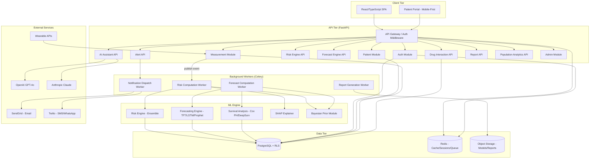
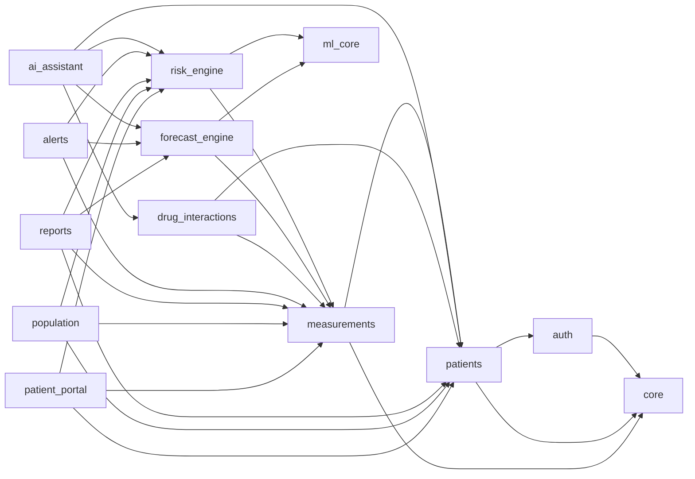
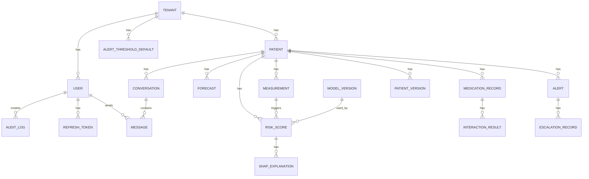
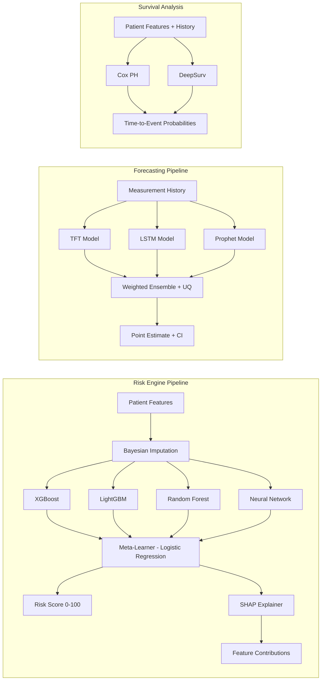

# Design Document: PrescpHealth SaaS Rebuild

## Overview

PrescpHealth is a greenfield rebuild of an AI-powered clinical decision support and predictive health SaaS platform. The system replaces a Streamlit prototype with a production-grade, multi-tenant architecture using React/TypeScript on the frontend and FastAPI (Python) on the backend, backed by PostgreSQL, Redis, and Celery workers.

The platform simultaneously predicts risk across six chronic diseases (Stroke, Cardiovascular Disease, Type 2 Diabetes, CKD, Hypertensive Crisis, COPD) using an ensemble ML engine, forecasts individual health trajectories over 3–12 month horizons, provides a conversational AI clinical assistant, checks drug interactions, and delivers multi-channel alerts — all from basic clinical measurements without imaging.

### Key Design Decisions

1. **Monorepo with clear module boundaries** — A single repository with `frontend/`, `backend/`, and `ml/` top-level directories. Each backend domain is a self-contained Python package under `backend/app/modules/`. This keeps deployment simple while enforcing separation of concerns.

2. **Tenant isolation via row-level security (RLS)** — PostgreSQL RLS policies filter every query by `tenant_id`, set from the JWT at request time. This avoids the operational cost of per-tenant schemas while providing strong isolation guarantees.

3. **Async ML inference via Celery** — Risk and forecast computations run on background workers, keeping API response times under 200ms. The frontend polls a task-status endpoint for results.

4. **ML model registry with versioned artifacts** — Models are stored as versioned artifacts (MLflow or S3-backed registry). Every prediction logs the model version used, enabling full audit trails and rollback.

5. **Event-driven alert pipeline** — Measurement saves and risk score updates publish domain events. The alert system subscribes to these events, evaluates threshold rules, and dispatches notifications through a priority queue.

6. **LLM provider abstraction** — The AI Assistant uses a provider interface with GPT-4o as primary and Claude as fallback. Automatic failover is transparent to the clinician.

---

## Architecture

### High-Level System Architecture



### Request Flow

1. Client sends request → API Gateway validates JWT, extracts `tenant_id`, sets PostgreSQL session variable `app.current_tenant`.
2. PostgreSQL RLS policies automatically filter all queries to the current tenant.
3. For ML operations: API enqueues a Celery task → returns `task_id` → client polls `/tasks/{task_id}/status`.
4. Background worker executes ML inference → stores results in PostgreSQL → publishes domain event.
5. Alert system evaluates events against threshold rules → dispatches notifications via priority queue.

### Module Dependency Map



---

## Components and Interfaces

### Backend Module Structure

```
backend/
├── app/
│   ├── main.py                    # FastAPI app factory, middleware registration
│   ├── config.py                  # Settings via pydantic-settings (env-based)
│   ├── core/
│   │   ├── database.py            # SQLAlchemy async engine, session factory
│   │   ├── security.py            # JWT encode/decode, password hashing (bcrypt)
│   │   ├── middleware.py          # TenantMiddleware, RateLimitMiddleware, AuditMiddleware
│   │   ├── events.py             # Domain event bus (in-process pub/sub)
│   │   ├── exceptions.py         # Custom exception hierarchy
│   │   ├── pagination.py         # Cursor-based pagination helpers
│   │   └── deps.py               # FastAPI dependency injection (get_db, get_current_user, get_tenant)
│   ├── modules/
│   │   ├── auth/
│   │   │   ├── router.py         # POST /login, /refresh, /logout, /mfa/verify
│   │   │   ├── service.py        # AuthService: authenticate, issue_tokens, rotate_refresh
│   │   │   ├── models.py         # User, RefreshToken, MFAConfig SQLAlchemy models
│   │   │   ├── schemas.py        # Pydantic request/response schemas
│   │   │   └── rbac.py           # Permission definitions, role hierarchy, require_role decorator
│   │   ├── patients/
│   │   │   ├── router.py         # CRUD + search + timeline endpoints
│   │   │   ├── service.py        # PatientService: create, update, search, get_timeline
│   │   │   ├── models.py         # Patient, PatientVersion SQLAlchemy models
│   │   │   └── schemas.py
│   │   ├── measurements/
│   │   │   ├── router.py         # POST /measurements, GET history, POST /bulk-import
│   │   │   ├── service.py        # MeasurementService: validate, save, flag_deviation
│   │   │   ├── models.py         # Measurement SQLAlchemy model
│   │   │   ├── schemas.py
│   │   │   └── validators.py     # Physiological range validators per measurement type
│   │   ├── risk_engine/
│   │   │   ├── router.py         # POST /compute, GET /scores/{patient_id}
│   │   │   ├── service.py        # RiskService: trigger_computation, get_scores
│   │   │   ├── models.py         # RiskScore, RiskComputation SQLAlchemy models
│   │   │   ├── schemas.py
│   │   │   └── tasks.py          # Celery tasks: compute_risk_scores
│   │   ├── forecast_engine/
│   │   │   ├── router.py         # POST /forecast, POST /simulate-intervention
│   │   │   ├── service.py        # ForecastService: trigger_forecast, simulate
│   │   │   ├── models.py         # Forecast, InterventionSimulation SQLAlchemy models
│   │   │   ├── schemas.py
│   │   │   └── tasks.py          # Celery tasks: compute_forecast, run_simulation
│   │   ├── ai_assistant/
│   │   │   ├── router.py         # POST /chat/{patient_id}, GET /history/{patient_id}
│   │   │   ├── service.py        # AIAssistantService: send_message, get_history
│   │   │   ├── models.py         # Conversation, Message SQLAlchemy models
│   │   │   ├── schemas.py
│   │   │   └── providers.py      # LLMProvider interface, GPT4oProvider, ClaudeProvider
│   │   ├── drug_interactions/
│   │   │   ├── router.py         # POST /check, GET /summary/{patient_id}
│   │   │   ├── service.py        # DrugInteractionService: check_ddi, check_dhi
│   │   │   ├── models.py         # MedicationRecord, InteractionResult, DrugDatabase
│   │   │   ├── schemas.py
│   │   │   └── engine.py         # Core DDI/DHI matching logic
│   │   ├── alerts/
│   │   │   ├── router.py         # GET /alerts, POST /acknowledge, PUT /thresholds
│   │   │   ├── service.py        # AlertService: evaluate_thresholds, escalate
│   │   │   ├── models.py         # Alert, AlertThreshold, EscalationRecord
│   │   │   ├── schemas.py
│   │   │   └── tasks.py          # Celery tasks: dispatch_notification, check_escalation
│   │   ├── reports/
│   │   │   ├── router.py         # POST /generate/clinical, /generate/referral, /export/csv
│   │   │   ├── service.py        # ReportService: generate_clinical_pdf, generate_referral
│   │   │   ├── schemas.py
│   │   │   └── tasks.py          # Celery tasks: generate_pdf, generate_csv
│   │   ├── population/
│   │   │   ├── router.py         # GET /dashboard, /watchlist, /trends
│   │   │   ├── service.py        # PopulationService: get_metrics, get_watchlist
│   │   │   ├── models.py         # CachedPopulationMetric
│   │   │   └── schemas.py
│   │   └── admin/
│   │       ├── router.py         # Tenant management, model management, system config
│   │       ├── service.py        # AdminService: create_tenant, deploy_model, rollback_model
│   │       └── schemas.py
│   └── workers/
│       ├── celery_app.py         # Celery app configuration, queue definitions
│       └── beat_schedule.py      # Periodic tasks (population metrics refresh, escalation checks)
├── alembic/                      # Database migrations
│   ├── env.py
│   └── versions/
├── tests/
│   ├── conftest.py               # Fixtures: test DB, test client, auth helpers
│   ├── unit/                     # Unit tests per module
│   ├── property/                 # Property-based tests
│   └── integration/              # Integration tests
├── alembic.ini
├── pyproject.toml
└── Dockerfile
```

### Frontend Structure

```
frontend/
├── src/
│   ├── app/
│   │   ├── App.tsx               # Root component, router setup
│   │   ├── routes.tsx            # Route definitions with role guards
│   │   └── providers.tsx         # Context providers (Auth, Tenant, Theme)
│   ├── api/
│   │   ├── client.ts             # Axios instance with JWT interceptor
│   │   ├── auth.ts               # Auth API calls
│   │   ├── patients.ts           # Patient API calls
│   │   ├── measurements.ts       # Measurement API calls
│   │   ├── risk.ts               # Risk engine API calls
│   │   ├── forecast.ts           # Forecast API calls
│   │   ├── assistant.ts          # AI assistant API calls
│   │   ├── alerts.ts             # Alert API calls
│   │   └── reports.ts            # Report API calls
│   ├── components/
│   │   ├── common/               # Buttons, inputs, modals, tables, charts
│   │   ├── auth/                 # LoginForm, MFAInput, RoleGuard
│   │   ├── patients/             # PatientList, PatientProfile, PatientTimeline
│   │   ├── measurements/         # MeasurementForm, MeasurementChart, BulkImport
│   │   ├── risk/                 # RiskDashboard, RiskGauge, SHAPChart
│   │   ├── forecast/             # ForecastChart, InterventionSimulator, SurvivalCurve
│   │   ├── assistant/            # ChatPanel, MessageBubble, ContextSidebar
│   │   ├── drugs/                # MedicationList, InteractionAlert, SafetySummary
│   │   ├── alerts/               # AlertBanner, AlertHistory, ThresholdConfig
│   │   ├── reports/              # ReportBuilder, PDFPreview
│   │   └── population/           # PopulationDashboard, WatchlistTable, TrendChart
│   ├── hooks/                    # Custom React hooks (useAuth, usePolling, usePatient)
│   ├── store/                    # Zustand stores (auth, patients, alerts)
│   ├── types/                    # TypeScript interfaces mirroring backend schemas
│   └── utils/                    # Formatters, validators, constants
├── public/
├── package.json
├── tsconfig.json
├── vite.config.ts
└── Dockerfile
```

### Key API Interfaces

#### Authentication

| Method | Endpoint | Description | Auth |
|--------|----------|-------------|------|
| POST | `/api/v1/auth/login` | Authenticate, return JWT + refresh token | None |
| POST | `/api/v1/auth/refresh` | Rotate refresh token, issue new JWT | Refresh token |
| POST | `/api/v1/auth/logout` | Invalidate refresh token | JWT |
| POST | `/api/v1/auth/mfa/verify` | Verify TOTP code during login | Partial session |

#### Patients

| Method | Endpoint | Description | Roles |
|--------|----------|-------------|-------|
| POST | `/api/v1/patients` | Create patient | Doctor, Clinic_Admin |
| GET | `/api/v1/patients` | Search/list patients | Doctor, Nurse, Clinic_Admin |
| GET | `/api/v1/patients/{id}` | Get patient profile | Doctor, Nurse |
| PUT | `/api/v1/patients/{id}` | Update patient profile | Doctor |
| GET | `/api/v1/patients/{id}/timeline` | Get patient timeline | Doctor, Nurse |

#### Measurements

| Method | Endpoint | Description | Roles |
|--------|----------|-------------|-------|
| POST | `/api/v1/patients/{id}/measurements` | Submit measurement | Doctor, Nurse, Patient_User |
| GET | `/api/v1/patients/{id}/measurements` | Get measurement history | Doctor, Nurse |
| POST | `/api/v1/patients/{id}/measurements/bulk` | CSV bulk import | Doctor, Nurse |
| PUT | `/api/v1/measurements/{id}/validate` | Validate patient-submitted measurement | Doctor |

#### Risk Engine

| Method | Endpoint | Description | Roles |
|--------|----------|-------------|-------|
| POST | `/api/v1/patients/{id}/risk/compute` | Trigger risk computation | Doctor, Nurse |
| GET | `/api/v1/patients/{id}/risk/scores` | Get latest risk scores | Doctor, Nurse |
| GET | `/api/v1/patients/{id}/risk/history` | Get risk score history | Doctor |

#### Forecast Engine

| Method | Endpoint | Description | Roles |
|--------|----------|-------------|-------|
| POST | `/api/v1/patients/{id}/forecast` | Trigger forecast computation | Doctor |
| GET | `/api/v1/patients/{id}/forecast/latest` | Get latest forecast | Doctor |
| POST | `/api/v1/patients/{id}/forecast/simulate` | Run intervention simulation | Doctor |

#### AI Assistant

| Method | Endpoint | Description | Roles |
|--------|----------|-------------|-------|
| POST | `/api/v1/patients/{id}/assistant/chat` | Send message | Doctor |
| GET | `/api/v1/patients/{id}/assistant/history` | Get conversation history | Doctor |

#### Drug Interactions

| Method | Endpoint | Description | Roles |
|--------|----------|-------------|-------|
| POST | `/api/v1/patients/{id}/medications` | Add medication (triggers DDI/DHI check) | Doctor |
| GET | `/api/v1/patients/{id}/medications/safety` | Get medication safety summary | Doctor, Nurse |
| POST | `/api/v1/interactions/{id}/override` | Override interaction alert | Doctor |

#### Alerts

| Method | Endpoint | Description | Roles |
|--------|----------|-------------|-------|
| GET | `/api/v1/alerts` | Get alerts for current user | All clinicians |
| POST | `/api/v1/alerts/{id}/acknowledge` | Acknowledge alert | Doctor, Nurse |
| PUT | `/api/v1/patients/{id}/alert-thresholds` | Configure thresholds | Doctor, Clinic_Admin |

#### Reports

| Method | Endpoint | Description | Roles |
|--------|----------|-------------|-------|
| POST | `/api/v1/patients/{id}/reports/clinical` | Generate clinical PDF | Doctor |
| POST | `/api/v1/patients/{id}/reports/referral` | Generate referral letter | Doctor |
| GET | `/api/v1/patients/{id}/export/measurements` | Export measurements CSV | Doctor |
| GET | `/api/v1/population/export` | Export population CSV | Clinic_Admin |

#### Background Tasks

| Method | Endpoint | Description | Roles |
|--------|----------|-------------|-------|
| GET | `/api/v1/tasks/{task_id}/status` | Poll task completion | All authenticated |

---

## Data Models

### Entity-Relationship Diagram



### Core Database Tables

#### `tenants`

| Column | Type | Constraints | Description |
|--------|------|-------------|-------------|
| `id` | UUID | PK, DEFAULT gen_random_uuid() | Tenant identifier |
| `name` | VARCHAR(255) | NOT NULL | Clinic/organization name |
| `slug` | VARCHAR(100) | UNIQUE, NOT NULL | URL-safe identifier |
| `data_residency_region` | VARCHAR(50) | NOT NULL | Data residency region code |
| `ip_allowlist` | JSONB | DEFAULT '[]' | Array of allowed CIDR ranges |
| `settings` | JSONB | DEFAULT '{}' | Tenant-specific configuration |
| `is_active` | BOOLEAN | DEFAULT TRUE | Soft-disable flag |
| `created_at` | TIMESTAMPTZ | NOT NULL, DEFAULT NOW() | Creation timestamp |
| `updated_at` | TIMESTAMPTZ | NOT NULL, DEFAULT NOW() | Last update timestamp |

#### `users`

| Column | Type | Constraints | Description |
|--------|------|-------------|-------------|
| `id` | UUID | PK | User identifier |
| `tenant_id` | UUID | FK → tenants.id, NOT NULL | Owning tenant |
| `email` | VARCHAR(255) | NOT NULL | Login email (unique per tenant) |
| `password_hash` | VARCHAR(255) | NOT NULL | bcrypt hash (cost 12) |
| `role` | VARCHAR(20) | NOT NULL, CHECK IN roles | One of: Patient_User, Nurse, Doctor, Clinic_Admin, Super_Admin |
| `full_name` | VARCHAR(255) | NOT NULL | Display name |
| `is_active` | BOOLEAN | DEFAULT TRUE | Account active flag |
| `is_locked` | BOOLEAN | DEFAULT FALSE | Locked after failed attempts |
| `failed_login_attempts` | INTEGER | DEFAULT 0 | Consecutive failed logins |
| `failed_login_window_start` | TIMESTAMPTZ | NULLABLE | Start of failed login window |
| `mfa_enabled` | BOOLEAN | DEFAULT FALSE | MFA toggle |
| `mfa_secret` | VARCHAR(255) | NULLABLE | TOTP secret (encrypted) |
| `created_at` | TIMESTAMPTZ | NOT NULL | Creation timestamp |
| `updated_at` | TIMESTAMPTZ | NOT NULL | Last update timestamp |

**RLS Policy:** `tenant_id = current_setting('app.current_tenant')::uuid`

#### `patients`

| Column | Type | Constraints | Description |
|--------|------|-------------|-------------|
| `id` | UUID | PK | Immutable patient identifier |
| `tenant_id` | UUID | FK → tenants.id, NOT NULL | Owning tenant |
| `full_name` | VARCHAR(255) | NOT NULL | Patient full name |
| `date_of_birth` | DATE | NOT NULL | Date of birth |
| `biological_sex` | VARCHAR(10) | NOT NULL, CHECK IN (Male, Female) | Biological sex |
| `ethnicity` | VARCHAR(100) | NULLABLE | Ethnicity |
| `country` | VARCHAR(100) | NOT NULL | Country of residence |
| `contact_phone` | VARCHAR(50) | NULLABLE | Contact phone |
| `emergency_contact` | JSONB | NULLABLE | {name, phone, relationship} |
| `diagnoses` | JSONB | DEFAULT '[]' | Array of ICD-10 coded diagnoses |
| `surgical_history` | JSONB | DEFAULT '[]' | Array of surgical history entries |
| `family_history` | JSONB | DEFAULT '{}' | {stroke: bool, cvd: bool, diabetes: bool, ckd: bool, hypertension: bool, copd: bool} |
| `allergies` | JSONB | DEFAULT '[]' | Array of {type, substance, severity} |
| `assigned_clinician_id` | UUID | FK → users.id, NULLABLE | Primary assigned clinician |
| `linked_user_id` | UUID | FK → users.id, NULLABLE | Patient_User account link |
| `wearable_config` | JSONB | NULLABLE | Wearable integration settings |
| `is_deleted` | BOOLEAN | DEFAULT FALSE | Soft delete flag |
| `created_at` | TIMESTAMPTZ | NOT NULL | Creation timestamp |
| `updated_at` | TIMESTAMPTZ | NOT NULL | Last update timestamp |

**RLS Policy:** `tenant_id = current_setting('app.current_tenant')::uuid`
**Indexes:** `(tenant_id, full_name)` GIN trigram for partial name search, `(tenant_id, is_deleted)`

#### `patient_versions`

| Column | Type | Constraints | Description |
|--------|------|-------------|-------------|
| `id` | UUID | PK | Version record identifier |
| `patient_id` | UUID | FK → patients.id, NOT NULL | Patient being versioned |
| `tenant_id` | UUID | FK → tenants.id, NOT NULL | Owning tenant |
| `changed_fields` | JSONB | NOT NULL | {field: {old: val, new: val}} |
| `changed_by` | UUID | FK → users.id, NOT NULL | User who made the change |
| `changed_at` | TIMESTAMPTZ | NOT NULL | Timestamp of change |

#### `measurements`

| Column | Type | Constraints | Description |
|--------|------|-------------|-------------|
| `id` | UUID | PK | Measurement identifier |
| `patient_id` | UUID | FK → patients.id, NOT NULL | Patient |
| `tenant_id` | UUID | FK → tenants.id, NOT NULL | Owning tenant |
| `measurement_type` | VARCHAR(50) | NOT NULL | Type key (e.g., systolic_bp, hba1c) |
| `value` | DECIMAL(10,4) | NOT NULL | Numeric value |
| `unit` | VARCHAR(20) | NOT NULL | Unit of measurement |
| `recorded_at` | TIMESTAMPTZ | NOT NULL | When measurement was taken |
| `source` | VARCHAR(20) | NOT NULL, CHECK IN (clinician, patient_self, wearable) | Data source |
| `is_validated` | BOOLEAN | DEFAULT FALSE | Clinician validation status |
| `validated_by` | UUID | FK → users.id, NULLABLE | Validating clinician |
| `validated_at` | TIMESTAMPTZ | NULLABLE | Validation timestamp |
| `is_flagged` | BOOLEAN | DEFAULT FALSE | Deviation flag |
| `submitted_by` | UUID | FK → users.id, NOT NULL | Submitting user |
| `created_at` | TIMESTAMPTZ | NOT NULL | Creation timestamp |

**RLS Policy:** `tenant_id = current_setting('app.current_tenant')::uuid`
**Unique Constraint:** `(patient_id, measurement_type, recorded_at, value)` — idempotency key
**Indexes:** `(patient_id, measurement_type, recorded_at DESC)` for time-series queries

#### `risk_scores`

| Column | Type | Constraints | Description |
|--------|------|-------------|-------------|
| `id` | UUID | PK | Risk score identifier |
| `patient_id` | UUID | FK → patients.id, NOT NULL | Patient |
| `tenant_id` | UUID | FK → tenants.id, NOT NULL | Owning tenant |
| `disease` | VARCHAR(50) | NOT NULL | Disease key (stroke, cvd, diabetes, ckd, hypertensive_crisis, copd) |
| `score` | DECIMAL(5,2) | NOT NULL, CHECK (0 <= score <= 100) | Risk score 0–100 |
| `stratum` | VARCHAR(10) | NOT NULL | Low, Moderate, High, Critical |
| `confidence_lower` | DECIMAL(5,2) | NOT NULL | 95% CI lower bound |
| `confidence_upper` | DECIMAL(5,2) | NOT NULL | 95% CI upper bound |
| `model_version_id` | UUID | FK → model_versions.id, NOT NULL | Model version used |
| `input_snapshot` | JSONB | NOT NULL | Frozen input features at computation time |
| `computation_id` | UUID | NOT NULL | Groups scores from same computation run |
| `computed_at` | TIMESTAMPTZ | NOT NULL | Computation timestamp |
| `created_at` | TIMESTAMPTZ | NOT NULL | Storage timestamp |

**Indexes:** `(patient_id, disease, computed_at DESC)` for latest score lookup

#### `shap_explanations`

| Column | Type | Constraints | Description |
|--------|------|-------------|-------------|
| `id` | UUID | PK | Explanation identifier |
| `risk_score_id` | UUID | FK → risk_scores.id, NOT NULL | Parent risk score |
| `tenant_id` | UUID | FK → tenants.id, NOT NULL | Owning tenant |
| `base_value` | DECIMAL(8,4) | NOT NULL | Model base value |
| `feature_contributions` | JSONB | NOT NULL | [{feature, value, shap_value, direction}] |
| `created_at` | TIMESTAMPTZ | NOT NULL | Creation timestamp |

#### `model_versions`

| Column | Type | Constraints | Description |
|--------|------|-------------|-------------|
| `id` | UUID | PK | Model version identifier |
| `disease` | VARCHAR(50) | NOT NULL | Disease this model predicts |
| `version` | VARCHAR(20) | NOT NULL | Semantic version (e.g., 1.2.0) |
| `artifact_path` | VARCHAR(500) | NOT NULL | S3/storage path to model artifact |
| `metrics` | JSONB | NOT NULL | {auc_roc, calibration_score, brier_score} |
| `is_active` | BOOLEAN | DEFAULT FALSE | Currently deployed flag |
| `deployed_at` | TIMESTAMPTZ | NULLABLE | Deployment timestamp |
| `deployed_by` | UUID | FK → users.id, NULLABLE | Deploying admin |
| `created_at` | TIMESTAMPTZ | NOT NULL | Creation timestamp |

**Unique Constraint:** `(disease, version)`

#### `forecasts`

| Column | Type | Constraints | Description |
|--------|------|-------------|-------------|
| `id` | UUID | PK | Forecast identifier |
| `patient_id` | UUID | FK → patients.id, NOT NULL | Patient |
| `tenant_id` | UUID | FK → tenants.id, NOT NULL | Owning tenant |
| `forecast_type` | VARCHAR(20) | NOT NULL | 'metric' or 'risk_trajectory' |
| `target` | VARCHAR(50) | NOT NULL | Metric type or disease key |
| `horizon_months` | INTEGER | NOT NULL, CHECK IN (3, 6, 12) | Forecast horizon |
| `point_estimate` | DECIMAL(10,4) | NOT NULL | Predicted value |
| `confidence_lower` | DECIMAL(10,4) | NOT NULL | 95% CI lower bound |
| `confidence_upper` | DECIMAL(10,4) | NOT NULL | 95% CI upper bound |
| `data_quality` | VARCHAR(20) | NOT NULL | 'full_data', 'sparse_data', 'prior_only' |
| `model_ensemble_weights` | JSONB | NOT NULL | {tft: w, lstm: w, prophet: w} |
| `computed_at` | TIMESTAMPTZ | NOT NULL | Computation timestamp |
| `created_at` | TIMESTAMPTZ | NOT NULL | Storage timestamp |

#### `intervention_simulations`

| Column | Type | Constraints | Description |
|--------|------|-------------|-------------|
| `id` | UUID | PK | Simulation identifier |
| `patient_id` | UUID | FK → patients.id, NOT NULL | Patient |
| `tenant_id` | UUID | FK → tenants.id, NOT NULL | Owning tenant |
| `intervention_type` | VARCHAR(100) | NOT NULL | e.g., 'weight_loss', 'smoking_cessation', 'medication_addition' |
| `parameters` | JSONB | NOT NULL | Intervention-specific parameters |
| `baseline_forecast_id` | UUID | FK → forecasts.id | Reference baseline forecast |
| `simulated_results` | JSONB | NOT NULL | Array of {horizon, metric, baseline_value, simulated_value, delta} |
| `computed_at` | TIMESTAMPTZ | NOT NULL | Computation timestamp |

#### `medication_records`

| Column | Type | Constraints | Description |
|--------|------|-------------|-------------|
| `id` | UUID | PK | Medication record identifier |
| `patient_id` | UUID | FK → patients.id, NOT NULL | Patient |
| `tenant_id` | UUID | FK → tenants.id, NOT NULL | Owning tenant |
| `drug_name` | VARCHAR(255) | NOT NULL | Drug name |
| `drug_code` | VARCHAR(50) | NULLABLE | RxNorm or ATC code |
| `dosage` | VARCHAR(100) | NOT NULL | Dosage string |
| `frequency` | VARCHAR(100) | NOT NULL | Frequency string |
| `route` | VARCHAR(50) | NOT NULL | Administration route |
| `start_date` | DATE | NOT NULL | Prescription start date |
| `end_date` | DATE | NULLABLE | Prescription end date (NULL = active) |
| `prescribed_by` | UUID | FK → users.id, NOT NULL | Prescribing clinician |
| `is_active` | BOOLEAN | DEFAULT TRUE | Currently active flag |
| `created_at` | TIMESTAMPTZ | NOT NULL | Creation timestamp |

#### `interaction_results`

| Column | Type | Constraints | Description |
|--------|------|-------------|-------------|
| `id` | UUID | PK | Interaction result identifier |
| `patient_id` | UUID | FK → patients.id, NOT NULL | Patient |
| `tenant_id` | UUID | FK → tenants.id, NOT NULL | Owning tenant |
| `interaction_type` | VARCHAR(5) | NOT NULL, CHECK IN ('DDI', 'DHI') | Interaction type |
| `medication_a_id` | UUID | FK → medication_records.id, NOT NULL | First drug (or triggering drug for DHI) |
| `medication_b_id` | UUID | FK → medication_records.id, NULLABLE | Second drug (NULL for DHI) |
| `health_condition` | VARCHAR(255) | NULLABLE | Health condition (for DHI) |
| `severity` | VARCHAR(20) | NOT NULL | Contraindicated, Major, Moderate, Minor |
| `mechanism` | TEXT | NOT NULL | Clinical mechanism description |
| `adverse_outcome` | TEXT | NOT NULL | Potential adverse outcome |
| `recommended_action` | TEXT | NOT NULL | Recommended clinical action |
| `is_overridden` | BOOLEAN | DEFAULT FALSE | Doctor override flag |
| `override_justification` | TEXT | NULLABLE | Free-text justification |
| `overridden_by` | UUID | FK → users.id, NULLABLE | Overriding doctor |
| `overridden_at` | TIMESTAMPTZ | NULLABLE | Override timestamp |
| `created_at` | TIMESTAMPTZ | NOT NULL | Creation timestamp |

#### `drug_interactions_db`

| Column | Type | Constraints | Description |
|--------|------|-------------|-------------|
| `id` | UUID | PK | Interaction database entry |
| `drug_a_code` | VARCHAR(50) | NOT NULL | Drug A code (RxNorm/ATC) |
| `drug_a_name` | VARCHAR(255) | NOT NULL | Drug A name |
| `drug_b_code` | VARCHAR(50) | NULLABLE | Drug B code (NULL for DHI) |
| `drug_b_name` | VARCHAR(255) | NULLABLE | Drug B name |
| `interaction_type` | VARCHAR(5) | NOT NULL | 'DDI' or 'DHI' |
| `health_condition` | VARCHAR(255) | NULLABLE | Condition for DHI |
| `severity` | VARCHAR(20) | NOT NULL | Severity classification |
| `mechanism` | TEXT | NOT NULL | Mechanism description |
| `adverse_outcome` | TEXT | NOT NULL | Adverse outcome description |
| `recommended_action` | TEXT | NOT NULL | Recommended action |
| `source` | VARCHAR(100) | NOT NULL | Data source (DrugBank, WHO, etc.) |
| `last_updated` | TIMESTAMPTZ | NOT NULL | Last update from source |

#### `conversations`

| Column | Type | Constraints | Description |
|--------|------|-------------|-------------|
| `id` | UUID | PK | Conversation identifier |
| `patient_id` | UUID | FK → patients.id, NOT NULL | Patient context |
| `tenant_id` | UUID | FK → tenants.id, NOT NULL | Owning tenant |
| `created_at` | TIMESTAMPTZ | NOT NULL | Creation timestamp |
| `updated_at` | TIMESTAMPTZ | NOT NULL | Last message timestamp |

#### `messages`

| Column | Type | Constraints | Description |
|--------|------|-------------|-------------|
| `id` | UUID | PK | Message identifier |
| `conversation_id` | UUID | FK → conversations.id, NOT NULL | Parent conversation |
| `tenant_id` | UUID | FK → tenants.id, NOT NULL | Owning tenant |
| `role` | VARCHAR(10) | NOT NULL, CHECK IN ('user', 'assistant') | Message role |
| `content` | TEXT | NOT NULL | Message content |
| `model_used` | VARCHAR(50) | NULLABLE | LLM model identifier (for assistant messages) |
| `model_version` | VARCHAR(50) | NULLABLE | LLM model version |
| `sent_by` | UUID | FK → users.id, NULLABLE | Clinician who sent (for user messages) |
| `created_at` | TIMESTAMPTZ | NOT NULL | Message timestamp |

#### `alerts`

| Column | Type | Constraints | Description |
|--------|------|-------------|-------------|
| `id` | UUID | PK | Alert identifier |
| `patient_id` | UUID | FK → patients.id, NOT NULL | Patient |
| `tenant_id` | UUID | FK → tenants.id, NOT NULL | Owning tenant |
| `alert_type` | VARCHAR(30) | NOT NULL | 'threshold_breach', 'forecast_warning', 'missed_followup', 'drug_interaction' |
| `severity` | VARCHAR(10) | NOT NULL | 'info', 'warning', 'critical' |
| `title` | VARCHAR(255) | NOT NULL | Alert title |
| `body` | TEXT | NOT NULL | Alert body with details |
| `payload` | JSONB | NULLABLE | Structured data (forecast details, threshold info) |
| `channels_dispatched` | JSONB | DEFAULT '[]' | Array of channels used |
| `current_escalation_level` | INTEGER | DEFAULT 0 | 0=Nurse, 1=Doctor, 2=Clinic_Admin |
| `is_acknowledged` | BOOLEAN | DEFAULT FALSE | Acknowledgment flag |
| `acknowledged_by` | UUID | FK → users.id, NULLABLE | Acknowledging user |
| `acknowledged_at` | TIMESTAMPTZ | NULLABLE | Acknowledgment timestamp |
| `acknowledgment_notes` | TEXT | NULLABLE | Clinician notes |
| `created_at` | TIMESTAMPTZ | NOT NULL | Creation timestamp |

#### `escalation_records`

| Column | Type | Constraints | Description |
|--------|------|-------------|-------------|
| `id` | UUID | PK | Escalation record identifier |
| `alert_id` | UUID | FK → alerts.id, NOT NULL | Parent alert |
| `tenant_id` | UUID | FK → tenants.id, NOT NULL | Owning tenant |
| `from_level` | INTEGER | NOT NULL | Previous escalation level |
| `to_level` | INTEGER | NOT NULL | New escalation level |
| `escalated_to_user_id` | UUID | FK → users.id, NOT NULL | User escalated to |
| `reason` | VARCHAR(100) | NOT NULL | e.g., 'timeout_15min' |
| `escalated_at` | TIMESTAMPTZ | NOT NULL | Escalation timestamp |

#### `alert_thresholds`

| Column | Type | Constraints | Description |
|--------|------|-------------|-------------|
| `id` | UUID | PK | Threshold identifier |
| `patient_id` | UUID | FK → patients.id, NULLABLE | Patient-specific (NULL = tenant default) |
| `tenant_id` | UUID | FK → tenants.id, NOT NULL | Owning tenant |
| `disease` | VARCHAR(50) | NOT NULL | Disease key |
| `metric_type` | VARCHAR(50) | NULLABLE | Specific metric (NULL = risk score) |
| `warning_threshold` | DECIMAL(10,4) | NOT NULL | Warning level |
| `critical_threshold` | DECIMAL(10,4) | NOT NULL | Critical level |
| `followup_interval_days` | INTEGER | NULLABLE | Days before missed-followup alert |
| `configured_by` | UUID | FK → users.id, NOT NULL | Configuring user |
| `created_at` | TIMESTAMPTZ | NOT NULL | Creation timestamp |
| `updated_at` | TIMESTAMPTZ | NOT NULL | Last update timestamp |

#### `audit_logs`

| Column | Type | Constraints | Description |
|--------|------|-------------|-------------|
| `id` | BIGSERIAL | PK | Auto-incrementing identifier |
| `tenant_id` | UUID | NOT NULL | Tenant context (or system for cross-tenant) |
| `user_id` | UUID | NOT NULL | Acting user |
| `action` | VARCHAR(50) | NOT NULL | e.g., 'patient.create', 'measurement.update', 'risk.compute' |
| `resource_type` | VARCHAR(50) | NOT NULL | e.g., 'patient', 'measurement' |
| `resource_id` | UUID | NULLABLE | Affected resource |
| `changes` | JSONB | NULLABLE | {field: {old, new}} for updates |
| `metadata` | JSONB | NULLABLE | Additional context (IP, user agent) |
| `created_at` | TIMESTAMPTZ | NOT NULL, DEFAULT NOW() | Event timestamp |

**Note:** This table has NO UPDATE or DELETE grants. Insert-only via a dedicated `audit_writer` database role. 7-year retention enforced via partitioning by month.

#### `refresh_tokens`

| Column | Type | Constraints | Description |
|--------|------|-------------|-------------|
| `id` | UUID | PK | Token identifier |
| `user_id` | UUID | FK → users.id, NOT NULL | Token owner |
| `token_hash` | VARCHAR(255) | NOT NULL, UNIQUE | SHA-256 hash of token |
| `is_revoked` | BOOLEAN | DEFAULT FALSE | Revocation flag |
| `expires_at` | TIMESTAMPTZ | NOT NULL | Expiry timestamp |
| `created_at` | TIMESTAMPTZ | NOT NULL | Creation timestamp |
| `replaced_by` | UUID | FK → refresh_tokens.id, NULLABLE | Token that replaced this one |

#### `background_tasks`

| Column | Type | Constraints | Description |
|--------|------|-------------|-------------|
| `id` | UUID | PK | Task identifier (matches Celery task ID) |
| `tenant_id` | UUID | FK → tenants.id, NOT NULL | Owning tenant |
| `task_type` | VARCHAR(50) | NOT NULL | e.g., 'risk_computation', 'forecast', 'report' |
| `status` | VARCHAR(20) | NOT NULL | 'pending', 'running', 'completed', 'failed' |
| `result` | JSONB | NULLABLE | Task result payload |
| `error_message` | TEXT | NULLABLE | Error details on failure |
| `retry_count` | INTEGER | DEFAULT 0 | Number of retries |
| `created_at` | TIMESTAMPTZ | NOT NULL | Creation timestamp |
| `updated_at` | TIMESTAMPTZ | NOT NULL | Last status update |

### ML Pipeline Architecture



### Measurement Validation Ranges

The system enforces physiologically plausible ranges for each measurement type. Values outside these ranges are rejected with a descriptive error.

| Measurement Type | Unit | Min | Max | Clinical Notes |
|-----------------|------|-----|-----|----------------|
| systolic_bp | mmHg | 60 | 300 | Below 60 = severe shock territory |
| diastolic_bp | mmHg | 30 | 200 | |
| bmi | kg/m² | 10 | 80 | Extremes are physiologically possible |
| fasting_glucose | mmol/L | 1.0 | 40.0 | |
| hba1c | % | 3.0 | 20.0 | |
| total_cholesterol | mmol/L | 1.0 | 20.0 | |
| hdl_cholesterol | mmol/L | 0.1 | 5.0 | |
| ldl_cholesterol | mmol/L | 0.1 | 15.0 | |
| triglycerides | mmol/L | 0.1 | 30.0 | |
| creatinine | µmol/L | 10 | 2000 | |
| egfr | mL/min/1.73m² | 2 | 200 | |
| spo2 | % | 50 | 100 | Below 50 is near-death |
| heart_rate | bpm | 20 | 300 | |
| fev1 | L | 0.1 | 8.0 | |
| fvc | L | 0.1 | 10.0 | |
| alcohol_consumption | units/week | 0 | 200 | |
| diet_quality_score | score | 1 | 10 | |

---

## Correctness Properties

*A property is a characteristic or behavior that should hold true across all valid executions of a system — essentially, a formal statement about what the system should do. Properties serve as the bridge between human-readable specifications and machine-verifiable correctness guarantees.*

### Property 1: Tenant Isolation Invariant

*For any* pair of tenants (T1, T2) where T1 ≠ T2, and *for any* API request authenticated as a user of T1, the platform SHALL return zero records belonging to T2. No sequence of valid API calls by a T1 user can produce a response containing T2 data, regardless of endpoint, query parameters, or request body content.

**Validates: Requirements 1.1, 1.5, 4.4, 18.6**

### Property 2: Risk Score Range Invariant

*For any* valid set of measurement inputs to the Risk Engine (including sparse inputs with Bayesian imputation), each returned Risk Score SHALL be a numeric value in the closed interval [0, 100]. This holds regardless of the combination, magnitude, or sparsity of input features.

**Validates: Requirements 6.1, 6.4, 6.7**

### Property 3: Risk Stratification Consistency

*For any* Risk Score produced by the Risk Engine, the assigned stratum SHALL be deterministically consistent with the score value: score in [0, 24] → Low, [25, 49] → Moderate, [50, 74] → High, [75, 100] → Critical. No exceptions exist to this mapping.

**Validates: Requirements 6.5**

### Property 4: SHAP Explanation Additivity

*For any* Risk Score computation, the sum of absolute SHAP values across all features SHALL account for the full difference between the model's base value and the predicted Risk Score, within a floating-point tolerance of 0.01. Formally: |Σ(shap_values) - (prediction - base_value)| < 0.01.

**Validates: Requirements 6.3, 6.9**

### Property 5: Measurement Validation and Round-Trip

*For any* measurement type and *for any* numeric value, the platform SHALL accept the value if and only if it falls within the defined physiological range for that type. Furthermore, *for any* measurement accepted by the platform, a subsequent GET request for that patient's measurement history SHALL return the submitted value unchanged.

**Validates: Requirements 5.2, 5.3**

### Property 6: Audit Log Append-Only Monotonicity

*For any* sequence of create, update, or delete operations on patient data, the count of audit log entries SHALL be monotonically non-decreasing. Each CUD operation SHALL produce exactly one audit log entry containing the acting user's identity, timestamp, changed fields, and previous values. No API operation — including those by Super_Admin — SHALL reduce the audit log entry count.

**Validates: Requirements 18.4, 18.5, 1.4, 11.6**

### Property 7: Confidence Interval Containment

*For any* forecast or risk score produced by the Forecasting Engine or Risk Engine that includes a 95% confidence interval, the point estimate SHALL fall within the returned bounds. Formally: lower_bound ≤ point_estimate ≤ upper_bound for every output.

**Validates: Requirements 6.4, 8.1, 8.3**

### Property 8: Role Permission Monotonicity

*For any* pair of roles (R_lower, R_higher) where R_higher has strictly greater privilege in the hierarchy Patient_User < Nurse < Doctor < Clinic_Admin < Super_Admin, the set of permitted API actions for R_higher SHALL be a strict superset of those permitted for R_lower. *For any* user attempting an action outside their role's permissions, the platform SHALL return HTTP 403.

**Validates: Requirements 3.1, 3.3, 3.4, 3.6**

### Property 9: Unvalidated Measurement Exclusion

*For any* patient with existing validated measurements and a computed Risk Score, adding an unvalidated patient-self-reported measurement SHALL NOT change the Risk Score. The Risk Score SHALL only change after a clinician validation event is recorded for that measurement.

**Validates: Requirements 5.4, 3.5**

### Property 10: Intervention Simulation Directional Monotonicity

*For any* intervention simulation involving a known risk-reducing intervention (weight loss, smoking cessation, medication addition with known efficacy), the simulated Risk Score trajectory SHALL be less than or equal to the baseline trajectory at every forecast horizon (3, 6, 12 months).

**Validates: Requirements 8.7**

### Property 11: Alert Escalation Ordering

*For any* Critical alert generated by the Alert System, the escalation sequence SHALL strictly follow the order: Nurse → Doctor → Clinic_Admin. No alert SHALL skip a level in the escalation chain, and no escalation SHALL occur before the configured acknowledgment timeout for the current level has elapsed (15 minutes for Nurse, 30 minutes for Doctor).

**Validates: Requirements 11.5**

### Property 12: CSV Export Round-Trip

*For any* patient measurement history exported as CSV by the Report Generator, re-importing the CSV via the bulk import endpoint SHALL produce measurement records with values identical to the originals within the precision of the CSV format. Formally: export(measurements) |> import == measurements (modulo formatting precision).

**Validates: Requirements 14.3, 5.7**

### Property 13: Token Rotation Invalidation Chain

*For any* refresh token rotation event producing token T_new from T_old, the previous token T_old SHALL be rejected on all subsequent uses with HTTP 401, regardless of T_old's original expiry time. Furthermore, if T_old is presented after invalidation, ALL active sessions for that user SHALL be invalidated.

**Validates: Requirements 2.3, 2.5**

### Property 14: Drug Interaction Severity-to-Alert Mapping

*For any* detected drug interaction, the platform SHALL display a blocking alert requiring explicit acknowledgment if the severity is Contraindicated or Major, and a non-blocking warning if the severity is Moderate or Minor. Each interaction result SHALL include: interacting drugs/condition pair, severity, mechanism, adverse outcome, and recommended action.

**Validates: Requirements 10.4, 10.5, 10.7**

### Property 15: Measurement Deviation Flagging

*For any* new measurement where the patient has sufficient historical data to compute a baseline, if the new value deviates from the patient's personal mean by more than two standard deviations, the measurement SHALL be flagged for clinician review. If the deviation is within two standard deviations, the measurement SHALL NOT be flagged.

**Validates: Requirements 5.6**

### Property 16: Patient Profile Version History

*For any* update to a patient profile field, the platform SHALL store the previous value in a versioned history record containing the changed fields with old and new values, the identity of the user who made the change, and the timestamp. The version history SHALL be accessible to Doctors and Clinic_Admins.

**Validates: Requirements 4.5**

### Property 17: Risk Computation Audit Completeness

*For any* Risk Score computation, the stored result SHALL include: the input feature snapshot (frozen at computation time), the model version identifier, the computation timestamp, and the SHAP explanation. No field SHALL be null or missing.

**Validates: Requirements 6.9, 7.3**

### Property 18: Input Sanitization

*For any* user-supplied input containing SQL injection patterns (e.g., `'; DROP TABLE --`) or XSS payloads (e.g., `<script>alert(1)</script>`), the platform SHALL either sanitize the input or reject the request. No injection payload SHALL be executed or stored in its raw executable form.

**Validates: Requirements 18.3**

---

## Error Handling

### Error Response Format

All API errors follow a consistent JSON structure:

```json
{
  "error": {
    "code": "VALIDATION_ERROR",
    "message": "Human-readable error description",
    "details": [
      {
        "field": "systolic_bp",
        "message": "Value 500 exceeds maximum plausible range of 300 mmHg",
        "code": "OUT_OF_RANGE"
      }
    ],
    "request_id": "uuid-for-tracing"
  }
}
```

### Error Categories and HTTP Status Codes

| Category | HTTP Status | Error Code | Description |
|----------|-------------|------------|-------------|
| Authentication failure | 401 | `AUTH_FAILED` | Invalid credentials, expired token |
| Token rotation violation | 401 | `TOKEN_REUSE_DETECTED` | Revoked refresh token presented → all sessions invalidated |
| Authorization failure | 403 | `FORBIDDEN` | Role insufficient, cross-tenant access, IP not allowlisted |
| Resource not found | 404 | `NOT_FOUND` | Resource doesn't exist or belongs to different tenant |
| Validation error | 422 | `VALIDATION_ERROR` | Request body fails schema or business rule validation |
| Duplicate resource | 409 | `CONFLICT` | Idempotency key collision (duplicate measurement) |
| Rate limit exceeded | 429 | `RATE_LIMITED` | Per-user rate limit exceeded; includes `Retry-After` header |
| ML computation failure | 500 | `ML_ENGINE_ERROR` | Risk/forecast engine internal error after retries exhausted |
| External service failure | 502 | `EXTERNAL_SERVICE_ERROR` | SendGrid, Twilio, OpenAI, Anthropic unavailable |
| Task timeout | 504 | `TASK_TIMEOUT` | Background task exceeded maximum execution time |

### Resilience Patterns

1. **LLM Failover**: GPT-4o → Claude automatic fallback on error or 8-second timeout. Both failures → return `AI_UNAVAILABLE` error with explicit message to clinician.

2. **Notification Queuing**: SendGrid/Twilio failures → queue with exponential backoff retry (24h for email, 6h for SMS). Failed notifications marked and Super_Admin alerted.

3. **Cache Degradation**: Redis unavailable → direct PostgreSQL queries. Log cache miss, no user-facing error. Performance may degrade but functionality preserved.

4. **Background Task Retry**: Up to 3 retries with exponential backoff (30s, 120s, 480s). After 3 failures → mark task as failed, alert Super_Admin, return error on next status poll.

5. **Database Connection Pool**: Connection pool exhaustion → queue requests with 5-second timeout before returning 503. Health check endpoint bypasses pool.

6. **Drug Interaction Engine**: If interaction database is unavailable → return warning that interaction check could not be completed, do NOT silently allow medication addition without check.

### Validation Error Handling by Module

- **Measurements**: Out-of-range values rejected with specific range information. Duplicate submissions (same patient, type, timestamp, value) return 409 with existing record ID.
- **Patient Profiles**: ICD-10 code validation against reference list. Invalid codes rejected with suggestion of closest match.
- **Medications**: Drug name validated against RxNorm/ATC database. Unknown drugs accepted with warning flag for manual review.
- **CSV Import**: Per-row validation with accumulated errors. Response includes row number, field, and error for each invalid row. Valid rows are imported; invalid rows are skipped.

---

## Testing Strategy

### Testing Pyramid

```
         ╱╲
        ╱  ╲        E2E Tests (Cypress/Playwright)
       ╱    ╲       - Critical user flows (login → measure → risk → alert)
      ╱──────╲      - Patient portal flows
     ╱        ╲
    ╱ Integration╲   Integration Tests (pytest + testcontainers)
   ╱    Tests     ╲  - API endpoint tests with real DB
  ╱                ╲ - Celery task execution tests
 ╱──────────────────╲- External service mock tests
╱                    ╲
╱   Unit + Property   ╲  Unit Tests (pytest) + Property Tests (Hypothesis)
╱       Tests          ╲ - Business logic, validators, RBAC, ML pipeline
╱──────────────────────────╲
```

### Property-Based Testing (Hypothesis)

The project uses [Hypothesis](https://hypothesis.readthedocs.io/) for property-based testing in Python.

**Configuration:**
- Minimum 100 examples per property test (via `@settings(max_examples=100)`)
- Each property test references its design document property number
- Tag format in test docstring: `Feature: prescphealth-saas-rebuild, Property {N}: {title}`

**Property tests to implement (mapped to Correctness Properties above):**

| Property | Test File | What It Tests |
|----------|-----------|---------------|
| P1: Tenant Isolation | `tests/property/test_tenant_isolation.py` | RLS filtering, cross-tenant rejection |
| P2: Risk Score Range | `tests/property/test_risk_engine.py` | Score always in [0, 100] |
| P3: Risk Stratification | `tests/property/test_risk_engine.py` | Stratum matches score range |
| P4: SHAP Additivity | `tests/property/test_risk_engine.py` | SHAP values sum correctly |
| P5: Measurement Validation | `tests/property/test_measurements.py` | Range acceptance/rejection + round-trip |
| P6: Audit Log Monotonicity | `tests/property/test_audit.py` | Log count never decreases |
| P7: CI Containment | `tests/property/test_confidence.py` | Point estimate within CI bounds |
| P8: RBAC Monotonicity | `tests/property/test_rbac.py` | Role hierarchy permission superset |
| P9: Unvalidated Exclusion | `tests/property/test_measurements.py` | Unvalidated data doesn't affect risk |
| P10: Intervention Monotonicity | `tests/property/test_forecast.py` | Beneficial intervention ≤ baseline |
| P11: Alert Escalation | `tests/property/test_alerts.py` | Strict Nurse→Doctor→Admin ordering |
| P12: CSV Round-Trip | `tests/property/test_reports.py` | Export then import = identity |
| P13: Token Rotation | `tests/property/test_auth.py` | Old token rejected after rotation |
| P14: Drug Severity Mapping | `tests/property/test_drug_interactions.py` | Severity → alert type mapping |
| P15: Deviation Flagging | `tests/property/test_measurements.py` | >2σ flagged, ≤2σ not flagged |
| P16: Version History | `tests/property/test_patients.py` | Updates produce version records |
| P17: Risk Audit Completeness | `tests/property/test_risk_engine.py` | All audit fields present |
| P18: Input Sanitization | `tests/property/test_security.py` | Injection payloads neutralized |

### Unit Testing (pytest)

Unit tests cover specific examples, edge cases, and integration points not suited for property testing:

- **Auth module**: MFA flow, account lockout after 5 attempts, logout token invalidation
- **Patient module**: Profile creation with all field types, search by each filter, timeline ordering
- **Measurement module**: Each measurement type acceptance, bulk CSV with mixed valid/invalid rows
- **Risk Engine**: Ensemble weight normalization, Bayesian prior fallback for sparse data
- **Forecast Engine**: Single-measurement patient handling, forecast at each horizon
- **AI Assistant**: GPT-4o → Claude failover, advisory label presence, conversation persistence
- **Drug Interactions**: DDI and DHI detection, override with justification, health status change re-evaluation
- **Alerts**: Threshold configuration, missed follow-up detection, channel dispatch
- **Reports**: PDF section completeness, referral letter structure, SVG chart embedding
- **Population**: Watchlist filtering (High/Critical only), metric aggregation

### Integration Testing

- **Database**: RLS policy enforcement with multiple tenant sessions
- **Celery**: Task enqueue → execute → status polling lifecycle
- **External services**: SendGrid/Twilio retry queuing on failure (mocked)
- **LLM failover**: GPT-4o timeout → Claude fallback (mocked)
- **End-to-end ML pipeline**: Measurement → risk computation → alert generation

### Frontend Testing

- **Vitest + React Testing Library**: Component unit tests
- **Playwright**: E2E tests for critical flows (login, patient creation, measurement entry, risk dashboard)
- **Accessibility**: axe-core integration for automated accessibility checks
- **Responsive**: Viewport tests at 320px, 768px, 1024px, 1440px

### CI/CD Pipeline

1. **Pre-commit**: Linting (ruff, eslint), type checking (mypy, tsc), formatting (black, prettier)
2. **Unit + Property tests**: Run on every PR. Property tests with 100 examples.
3. **Integration tests**: Run on every PR against testcontainers (PostgreSQL, Redis)
4. **E2E tests**: Run on merge to main
5. **Performance benchmarks**: Weekly scheduled run measuring API latency, ML inference time
6. **Security scan**: Dependency audit (safety, npm audit), SAST (bandit, semgrep)
